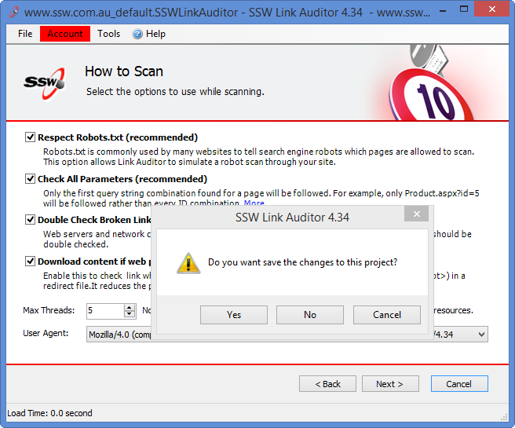

There should always be default values in your application if you allow users to change the settings. This will help your users to have a better first time experience and insure the application work as expected.

<!--endintro-->

However when the users change settings for their own preference, it is better to save these settings and give user has a better return experience, your application looks smarter in this way.

