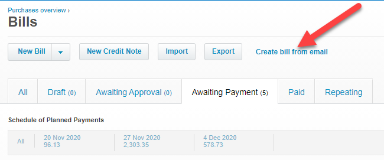
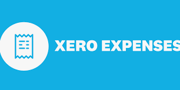
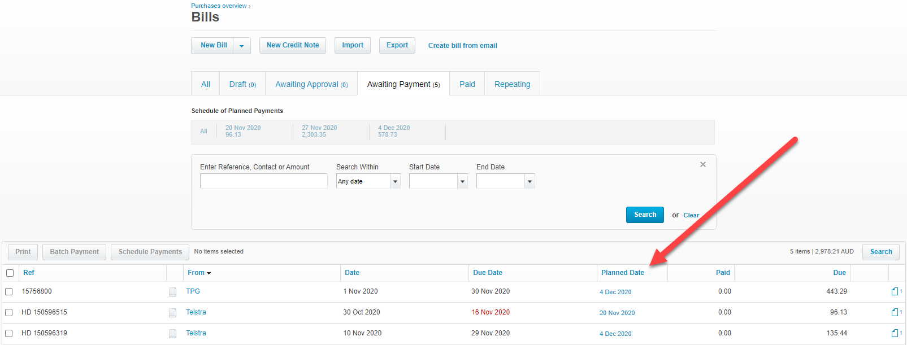
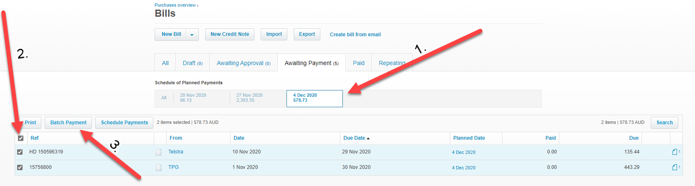

​​​​​​​Making payments should not require too much admin and the systems in place should mean making payments becomes a standard process. Most businesses should have an accounts department to handle payments and supplier relationships.  It is recommended that you schedule payments through your accounting system and make payment on a regular and consistent period, for example, every Friday. This enables a more connected reconciliation of the books and a greater ability to manage supplier relationships and cash-flow.  Scheduled payments means you won't need to make individual payments through your banking portal at random intervals and you will be able to send remittances all at once at a regular time. 

 <excerpt class='endintro'></excerpt> 

​At SSW, we use our Accounting software (Xero) to schedule payments. All invoices and bills are either emailed or pushed through to the bill's section via an expense app (we recommend using either Xero Expense or Hubdoc app).  

 <strong>Figure: Use Xero's bill creation via email forwarding process</strong>

<strong>​</strong>OR 

​ <strong>Figure: Use Xero Expense for capturing bills or money spent</strong>

Once the invoice is in the bill's section, you can schedule a planned payment date.  

<strong>Figure: Scheduling area of unpaid bills</strong>

It is important to have a usual day of payment, so the accounts department is able to follow the agreed terms for scheduling and maintain consistency throughout. At SSW, we batch our payments on a weekly basis to be paid on Friday. Additionally, the accounts team should agree on whether payments are made prior to the due date or a number of days following the due date.  

​It is then super easy to make a batch payment on the day of​ payment. Simply select the relevant date under the schedule of planned payments and select all invoices to be batched and paid through your banking portal. There should be no restrictions to the number of invoices to be paid at any one time so the business should be able to make all the weekly payments in one go, saving countless amounts of time not needed to process invoices daily and earlier than required.​ <strong>Figure: prepare batch payment for scheduled payments on a specific date</strong> 

Note: all scheduled payments should ideally have an attached PDF of the invoice, as represented by the image of a paper document on the end of each transaction. This is useful for auditing purposes and referring or double-checking.  

​In terms of cash-flow planning, it is useful to know the payment amounts that are expected to be paid on a certain date. This helps to avoid any surprises and assists in knowing the amount of cash available to be spent up to a certain date (after considering bills payable).  

Following good due processes will ensure suppliers know what the business standard payment procedures are (expected payment dates can be defaulted) and can help to improve supplier relationship. Invoices won't simply go missing or forgotten and all audit steps are tracked.  

​ 

