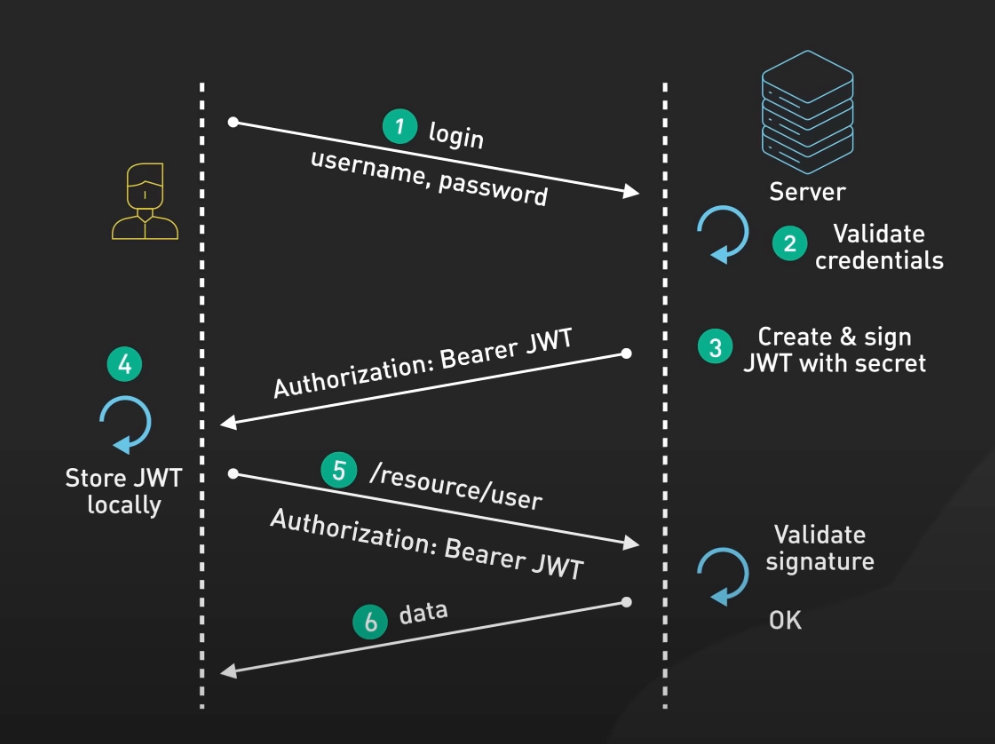

# Do you securely implement and handle JWT Tokens?

JSON Web Tokens (JWTs) offer a compact and secure means of transmitting information between parties as JSON objects. Their ability to encode identity and claim information has made them popular in modern web development for authentication and authorization processes. However, handling JWTs securely is essential to prevent potential security breaches, such as token theft leading to unauthorized access.

## JWTs Explained

<https://www.youtube.com/embed/P2CPd9ynFLg>
**Video**: JWTs eveyrthing you need to know (5mins)

<!--endintro-->

### Why JWTs Are Popular

JWTs are favored for their:
* **Compactness:** Making them easily transmissible via URL, POST parameters, or inside HTTP headers.
* **Self-contained nature:** Carrying all necessary information, reducing the need for database lookups to authenticate requests.
* **Versatility:** Being used in various scenarios, from Single Sign-On (SSO) to cross-service authentication in microservices architectures.

### How JWT token are used

JWTs token are used to implement authorised access for resouces (APIs) in an application, here is how a typical flow looks like:

* **User Authentication:** A user logs in to an application, and the server creates and issues a signed JWT token upon successful authentication.
* **Token Storage:** The client application receives the JWT and stores it securely, typically in local storage or a secure cookie.
* **Authorised access:** The client sends the JWT with each subsequent request to the server by putting it in the header of the request as a bearer token. The server when processing the request verifies the token's signature and the claims present, for granting access to the requested resource if the token is valid.
* **Token Expiry:** The server can set an expiry time for the token, after which the client must re-authenticate to obtain a new token. In a typical case a refresh token is also issued with the access token which can be used to obtain a new access token without the user having to re-authenticate.

### Token Signing Algorithms: Symmetric vs. Asymmetric

When it comes to securing JWTs, the choice of signing algorithm plays a critical role. Here's a breakdown to help you choose:

#### Symmetric Algorithms (e.g., HMAC, HS256)

* **How it works:** Uses a single secret key for both signing and verification processes.
* **Pros:** Fast computation and straightforward implementation.
* **Cons:** The secret key must be shared between the issuer and the verifier, posing a risk if the key is exposed.
* **Best used when:** The issuer and verifier of the JWT are the same entity, or when secure key sharing is feasible.

#### Asymmetric Algorithms (e.g., RSA, ECDSA)

* **How it works:** Utilizes a public/private key pair; the JWT is signed with the private key and verified with the public key.
* **Pros:** Increased security as the private key never needs to be shared; the public key can be openly distributed for token verification.
* **Cons:** More computationally intensive, leading to slower performance.
* **Best used when:** Multiple parties need to verify the token without sharing a secret, such as in distributed systems.

### Best Practices for JWT Implementation

1. **Keep Payloads Lean and Non-sensitive:** Avoid storing sensitive information in the JWT payload. If you must, ensure it's encrypted.
2. **Utilize Short Expiry Times:** This limits the window of opportunity for a token to be misused if compromised.
3. **Secure Token Storage:** Implement secure mechanisms to store and transmit tokens, such as HTTPS and secure cookies.
4. **Regular Key Rotation:** Particularly for symmetric keys, regularly update and securely distribute them to mitigate the risk of key exposure.

### Handling JWT Vulnerabilities

Be aware of common threats like:
* **Token Hijacking:** Implement stringent token handling and transmission security measures.
* **Weak Signatures:** Use strong cryptographic algorithms to prevent brute force attacks on token signatures.

JWTs are a powerful tool for secure communication in web applications. By understanding the importance of signing algorithms and sticking to best practices, developers can effectively mitigate associated risks, ensuring that JWTs remain a robust solution for authentication and authorization. Choose the right algorithm based on your architectural needs and follow best practices to protect against common vulnerabilities.
