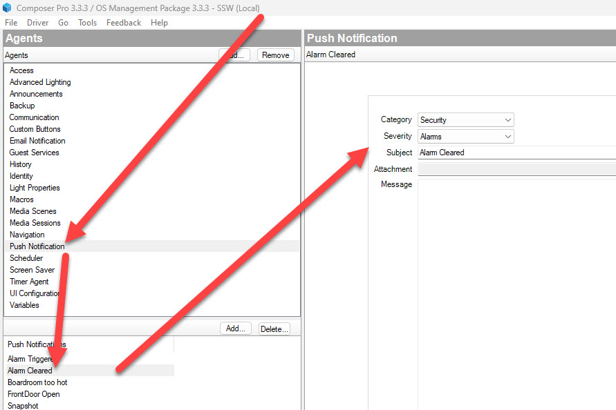

Don't let important alarm events go unnoticed! With Control4, you can set up notifications to keep everyone informed when an alarm is triggered. 📣🚨

This uses the "Push Notification" agent in Control4.

<!--endintro-->

To ensure that people are promptly notified when an alarm is triggered in Control4, follow these steps:

1. Open the Control4 Composer software and navigate to your project. 🏠
2. Access the "Agents" section in and create an "Alarm Triggered" push notification. This is the message that will appear on whoever has the app installed when it triggers!🔒

::: good

:::

1. When done, go to "Programming", and go to your Security Panel driver that handles alarms.
2. Add the "Send Push Notification" action in Composer. 📧💬
3. Customize the notification message to include relevant details such as the type of alarm, the location, and any additional instructions. 📝
4. Test the alarm system by triggering an alarm event. 🚨
5. Ensure that the notifications are being sent to mobile phones with the Control4 app installed. 📲🏡
6. (Optional) Follow our "Do you send Control4 notifications to a Slack channel?" to send this alert to other channels.

::: good

:::

That's it! Now, whenever an alarm is triggered in your Control4 system, the configured notifications will be sent to the designated recipients, keeping everyone informed and enhancing security. 🙌

Remember, timely notifications are crucial in ensuring a swift response to alarm events. By setting up Control4 notifications, you can provide peace of mind and enhance the overall security of your premises. 🚀🔒
