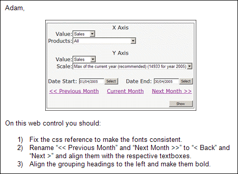
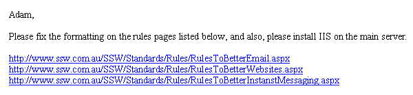
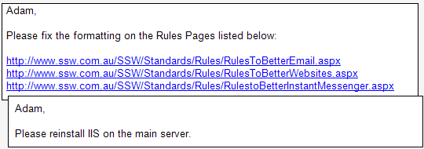

​Do you sometimes find that people don't attend to all the items you have listed in your long and carefully drafted email?  
 <excerpt class='endintro'></excerpt> 

Make it easier for everyone to track the status of tasks by sending tasks one email at a time, and make the requests very clear. When a person has completed a task they just have to reply "Done" to that email, delete the email from their inbox and then move on to the next task. 
<h3 class="ssw15-rteElement-H3">Grouping related tasks  </h3>

Obviously, if you are requesting many small changes to the same page, use one email as they're related to the same topic. In this case number each task that you wish to be completed, as per "<a href="/_layouts/15/FIXUPREDIRECT.ASPX?WebId=3dfc0e07-e23a-4cbb-aac2-e778b71166a2&TermSetId=07da3ddf-0924-4cd2-a6d4-a4809ae20160&TermId=072d00e3-9704-4c03-acc5-81b449d27a1c">Do you number small tasks related to 1 topic</a>". If all the tasks are very simple and everything was done as specified, the person who completed the tasks replies with a single "Done" to the whole email. 

<b>Warning:</b> Don't group unrelated topics 

Figure: Good Example - A few related tasks in one email
<h3 class="ssw15-rteElement-H3">Breaking up monster tasks  </h3>

If you have a very large task that requires days of work, it is better to break it up and send separate emails. So that a task "Boil the Ocean" would become:
<ul><li>"Boil the Ocean #1", </li><li>"Boil the Ocean #2", </li><li>"Boil the Ocean #3" etc. </li></ul>
The advantages are that you get an email history on a specific part and it is easier to include someone else.  

<b>Tip: </b>Understand tasks sizes by reading:​ <a href="/_layouts/15/FIXUPREDIRECT.ASPX?WebId=3dfc0e07-e23a-4cbb-aac2-e778b71166a2&TermSetId=07da3ddf-0924-4cd2-a6d4-a4809ae20160&TermId=51296135-61d2-46bd-bee5-50f992199d99">Estimating - Do you know how to size user stories effectively? </a> 

 Figure: Bad Example - One email for multiple separate tasks  Figure: Good Example - Separate emails for separate tasks  TODO: Make grey boxes with clear separated emails - change from IIS to Git Repo + will become 3 emails<h3 class="ssw15-rteElement-H3">Replying 'dones'  </h3>
When replying to these emails, reply to each email individually. Don't consolidate them all into one as it leaves unfinished email threads.  

 

