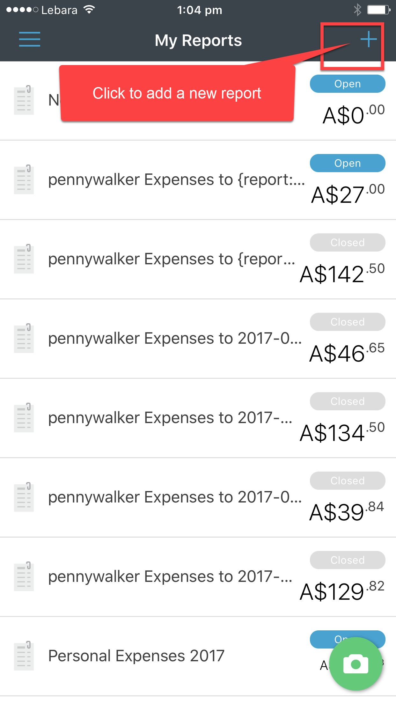

Does your Account Manager get confused when you try to claim all of your expenses at once?

Expensify lets you separate your expenses into different folders to avoid confusion. You can make a new report for different work clients, events that you have attended, or to separate your personal from work expenses. 

<!--endintro-->
<dl class="ssw15-rteElement-ImageArea"></dl>

::: bad
Bad example: Two unrelated expenses in the same folder, this can be confusing to Accounts Staff.

:::

Expensify lets you create new reports so that you can separate your receipts and reports.
<dl class="ssw15-rteElement-ImageArea"></dl>

::: good
Good example: Expenses separated into different folders - easier to claim and track what your receipts were for!

:::

### To Create a new folder on an iPhone:

1. Open Expensify app on your phone

2. From the Dashboard select "Reports"
<dl class="ssw15-rteElement-ImageArea"> </dl><dl class="ssw15-rteElement-ImageArea">3. Add a new report by clicking on the + symbol.  </dl><dl class="ssw15-rteElement-ImageArea"> </dl>
4. Click in the area of text that says "New Report" to re-name the report.

<dl class="ssw15-rteElement-ImageArea"></dl>

5. Re-name your report and then save. You can also change the policy if required. To automatically email your receipts to New, select the SSW policy.

<dl class="ssw15-rteElement-ImageArea"></dl>

6. You can then add expenses directly into the folder.
<dl class="ssw15-rteElement-ImageArea"> </dl>
### To Edit a folder on the iPhone

If you put a receipt in the wrong folder, you can edit its location, or upload a receipt directly into the new folder.

1. On your Dashboard select Expenses | Select correct expense to edit | Report
<dl class="ssw15-rteElement-ImageArea"> </dl><dl class="ssw15-rteElement-ImageArea">2. Select the folder you want to move it to and save. </dl><dl class="ssw15-rteElement-ImageArea"> </dl>
