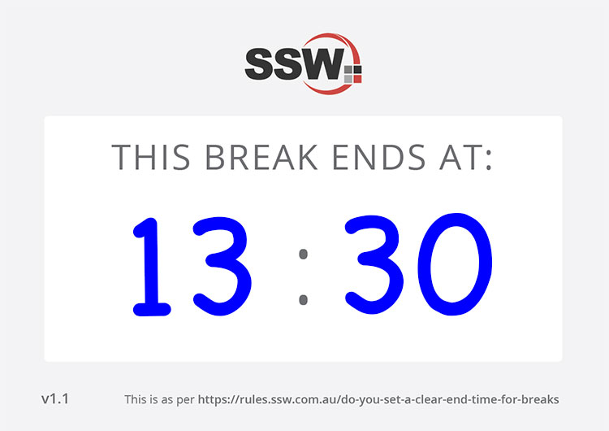
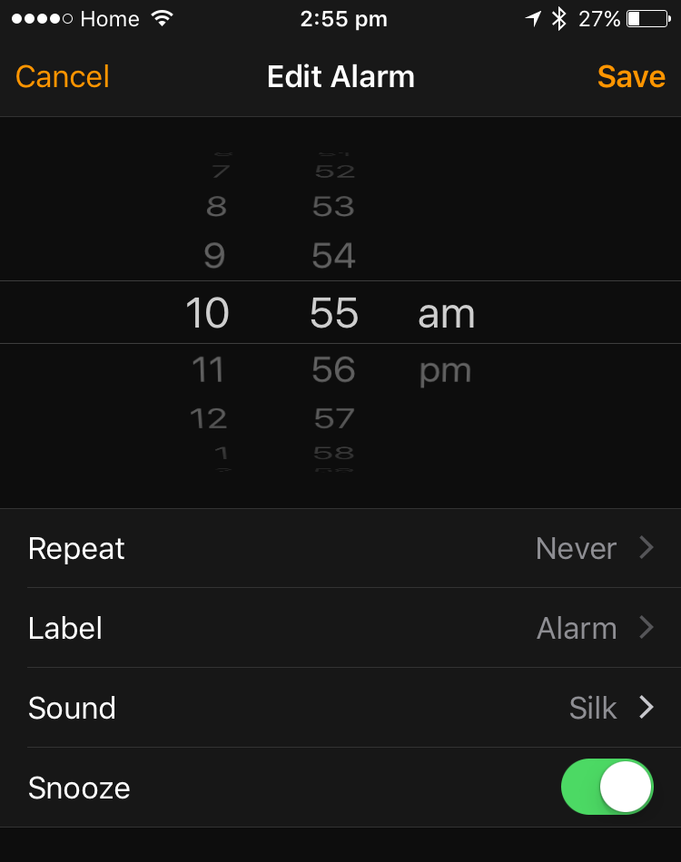

When you set a break at a training course, you should make sure you first finish what you are doing. Don’t cut people off because of a clock.

<!--endintro-->
 Tell them 20 min break (or 1 hour for lunch) and:
* Let them break
* Write in a clear place the end time for the break and ask people to be back on time  
  

* Set an alarm on your phone or PC

  

* If anyone comes back late,  **explain the value of integrity** . Honoring your word in small things makes it easier to honor it for larger things, such as doing your best in a Sprint, and makes people believe in you more
