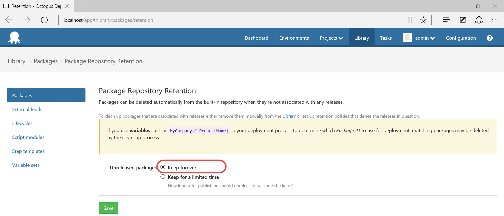
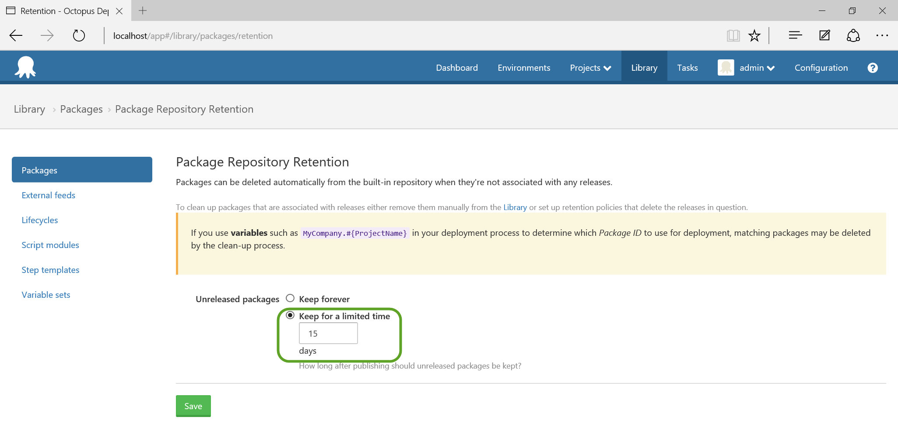
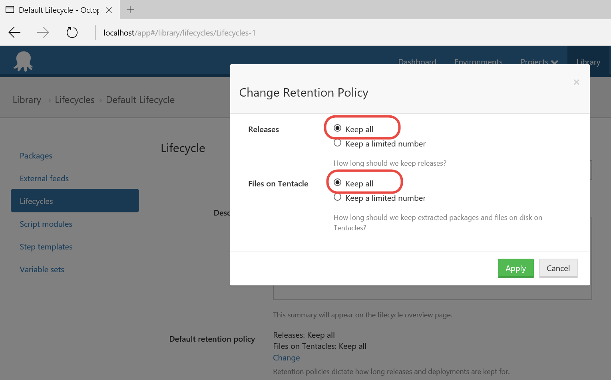
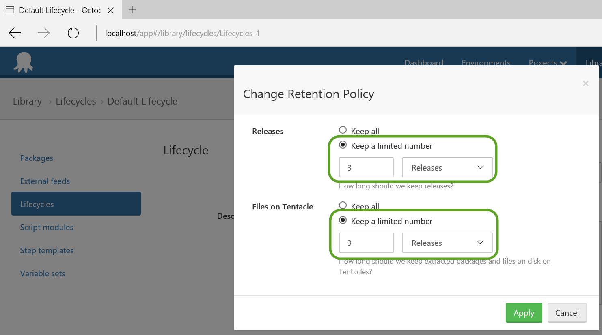

Octopus
Deploy will by default keep all packages (NuGet, ZIP, …) as well as files
deployed on all Tentacles. Because of that your hard drive will fill up very
fast as you keep pushing in more packages and creating more releases,
especially if you are using Continuous Integration and pushing out new packages
with every commit to a repository.

 <excerpt class='endintro'></excerpt> 
That's why you need to set up a retention policy. Octopus Deploy supports two options: <ul><li>Retention policy for packages </li><li>Retention policy for deployments (via Lifecycle phases)</li></ul>You should set up both.
 
<h3 class="ssw15-rteElement-H3">Package Policy​</h3>
 

 
<dd class="ssw15-rteElement-FigureBad">​Bad
Example - Retention policy is set to Keep forever​​</dd>
​​ 

​​ 
<dd class="ssw15-rteElement-FigureGood">​Good
Example - Retention policy is set to a number of days​</dd>
​ 
<h3 class="ssw15-rteElement-H3">Lifecycle Policy </h3>
 
<dd class="ssw15-rteElement-FigureBad">Bad
Example - Lifecycle's retention policy is set to Keep all​</dd>
​​ 

 
<dd class="ssw15-rteElement-FigureGood">​Good
Example - Lifecycle's retention policy is set to 3 Releases </dd>
 

