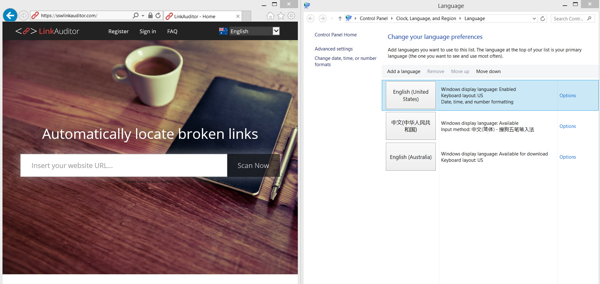

If you are localizing your web application to make it available in a varitety of languages, it's better to ​set your application default language to automatically change to local language. e.g. Make the web application default language as same as the browser language. 

 <excerpt class='endintro'></excerpt> 

​In order to use your web application in your preferred language, simply set that language in your browser, save/apply the new settings and then launch your application.        
<dd style="border:currentcolor;line-height:16px;">Figure: Detect your users language preference and display in that language​. ​</dd>
 

