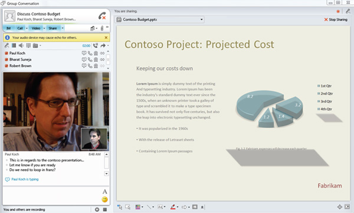

​​The Lync meeting experience is designed to allow people to collaborate productively from different locations. In Microsoft Lync, conference call leaders are referred to as presenters. The meeting organizer is automatically a leader.​​​ 

 <excerpt class='endintro'></excerpt> 

Lync presenter's best practices can be found 
   <a target="_blank" href="https://support.microsoft.com/en-us/office/best-practices-for-a-lync-meeting-d48ee355-e366-4de6-a0f5-bdbd75b35640">here</a>.
<h3>Features</h3>
A Lync whiteboard is a blank page that allows presenters to draw, add text, and highlight information by using the annotation tools.

Desktop and application sharing, this feature allows presenters to broadcast any visuals, applications, webpages, documents, software, or part of their desktops to remote participants in real-time, right from Lync.

Application sharing allows audience members to follow along with mouse movements and keyboard input. Presenters can choose to share the entire screen or only a portion to keep the audience focused on key information. By sharing their desktops, presenters are able to engage with their audiences in interactive product or software demos from any location.

Application sharing allows presenters to share control of software on their desktops without losing sight of participant feedback or text questions.
<dl class="image"><dt>
      
   </dt><dd>Figure: Application sharing, note the ability to view questions from participants</dd></dl>
Presenters can delegate control to meeting participants. Presenters can customize the colo​r depth and screen resolution to better engage with participants who have varying desktop capabilities.​​

