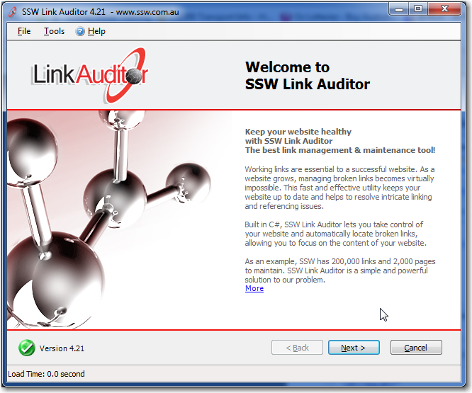

It is best practice to always include an applications version somewhere within  the app, but do you also include the database version, its just as important! 

  

Let's see how to show the Database version:
 
<!--endintro-->

### Modern Applications

These days frameworks handle database versioning for us, using code first migrations we can tell the application to automatically update the database when it starts up so its always at the latest version.

### Legacy Applications

For legacy applications that aren't using Frameworks such as EF, keeping track of a databases version can be done in the following way. 

Create a new table that will store the version info, this table is often called **\_zsDataVersion**.
  

For SSW Link Auditor this can be seen in the table status section.
  

