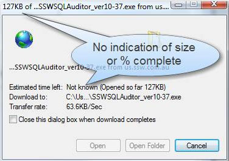
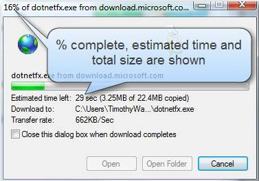

When a user downloads a file from your site, they should see a progress bar along with the total size and estimated time, this way they will see the size of the download increasing and will knowing when it will finish.

<!--endintro-->

::: bad  
  
:::

::: good  
  
:::
