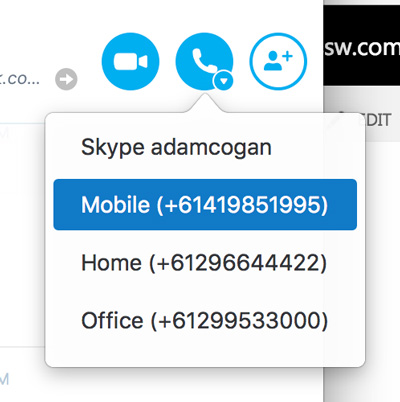

 Email is great. But in an emergency, you need to pick up the phone. Often the most effective methods of communication for a project is to talk directly to colleagues and clients on the phone. 

 <excerpt class='endintro'></excerpt> 
<dl class="badImage"><dt>
      
   </dt><dd>Figure: Bad example - can't call a phone number</dd></dl><dl class="goodImage"><dt>
      
   </dt><dd>Figure: Good example - Able to call phone numbers</dd></dl>

   <b>Remote offices tip: </b>Don’t make being overseas a barrier. ​Of course,​ it is always best to provide a local number as that gives clients peace of mind and keep their costs down. Not many clients will call an international number and there are lots of options - <a href="http://www.skype.com/en/features/"> 
      http://www.skype.com/en/features</a>.

The next best alternative is to at least show your overseas phone number.​ 

