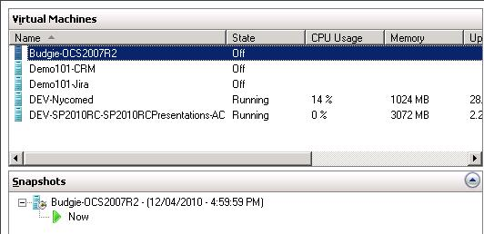

Snapshots are a very easy way to back up a system before a big change is made. They can also be easily restored if something goes wrong during the change.

<!--endintro-->

1. In the  **Hyper-V Manager** , ensure the Virtual Machine has the state of  **Off**
2. Right click on the virtual machine you wish to snapshot and click  **Snapshot**
3. The snapshot should run very quickly and you will notice the snapshot in the  **Snapshots** area of the  **Hyper-V Manager

**
 <strong>You will see the snapshots associated with a Virtual Machine when you click on them</strong> 
