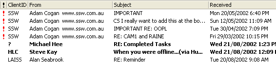

OK - so now you've got your important emails identified, don't let them get lost in the quagmire. If you use Outlook make use of its inbuilt functionality. Always sort your emails by the Received, but add a secondary sort by "Important". This way your important emails always stay at the top to haunt you until they are done.

<!--endintro-->

Figure: Good Example - Sorted by Important and Received Date
The Red Exclamation Mark is a good start, but the Blue Arrow keeps getting my attention.

Use sort by importance to sort the items with the blue arrow to the bottom.
