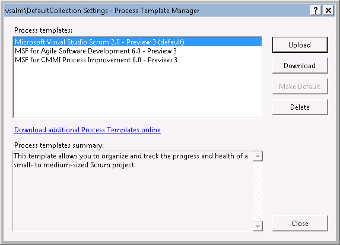

​TFS 2012 includes 3 built-in process templates: ​​ Figure: built-in process templates in TFS 2​012Instead of starting from scratch, you should always choose one of these built-in templates to do your own customization. It will depend on the target process for you to choose which one, for small and simple process, Scrum and Agile templates are recommended; for formal and complex process, choose the CMMI template.​
 <excerpt class='endintro'></excerpt> 
​Using an existing process template will save you a lot of time because <ul><li> It has the structure setup already, all you need to do is to make modifications and upload the template back to the server again.   </li>
<li>All the built-in reports could be used as a template for your customization, this will save you a lot of time from creating a new report​.</li></ul>

 

