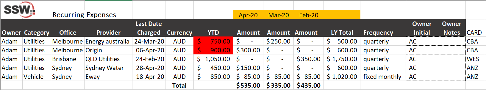

At SSW, we strongly believe in the benefits of accurately tracking recurring subscriptions both for cash flow purposes and for avoiding surprises down the track. 

Subscriptions are part of the very fabric of everyday business, these include but are not limited to phone bills, rent, software subscriptions and many more. Businesses can commonly become unaware of the real costs of subscriptions, especially to those businesses that enter in a direct debit system with their suppliers. Have you ever been prompted to look at the cost of a subscription and asked yourself, "since when has this subscription cost gone up two times?" 

<!--endintro-->

It may be the subscription was entered many years ago and you have yet to revisit it since and likely missed the emails of automatic increases somewhere in your many thousands of emails in your inbox.

With technological changes, comes a greater need to focus on tracking your subscriptions before it becomes a problem for the business or an unpleasant surprise.

A common solution many business owners used to solve the issues of tracking is by delegating the responsibilities to their finance team or accountant. This is a big assumption that they follow accurate and proper due process when completing the regular tracking procedures. 

1. Do they follow a proper process in tracking by using a tool or software? Excel is a great simple tool which all businesses can use successfully.

2. Is there an agreed time each month, to review and update the dataset from the tool? 

3. Does the dataset make it simple to pinpoint when significant or unusual changes have occurred? Example includes increases in subscription costs or non-payment of a subscription. With excel, we recommend the use of formulas and conditional formatting to ensure these occurrences can be pinpointed.

4. Can the dataset extract information on the owner and the total cost of the subscription?

5. Has the owner of each subscription provided their initials or confirmation each review period, that the subscription is accurate and as expected?

::: bad

:::

::: good

:::

There is no foolproof process that will avoid every unwanted situation, however, by following proper expense tracking will ensure these situations are discovered before it becomes a major issue and it may provide more reporting layers in order to make better financial decisions.
