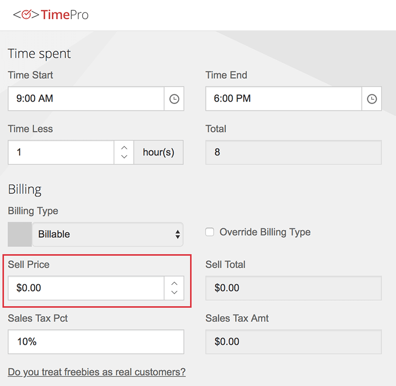

In the course of business, you may occasionally provide some services or products to selected customers free of charge or at a discount rate. Often, because you're waiving one rule (the "please pay me" one!), people assume all other rules of service are waived - you should avoid that assumption!

<!--endintro-->

#### 1. Freebies/discounts need just as strict controls as regular projects

When you are giving something away at a discount or for free you are expecting a loss compared with a regular client. If you fail to follow regular processes not only will you incur an even greater loss you provide a lesser standard of service and put greater risk on the success of the project.
A discount or freebie should follow all the standard processes such as:

* [Initial meetings](/meetings-are-you-prepared-for-the-initial-meeting)
* [Written contracts](/do-you-enter-into-a-binding-written-contract-with-a-client-before-doing-any-billable-work)
* [Specification reviews](/conduct-a-spec-review)
* Release plans
* [Triaging additional items](/estimating-do-you-know-what-tasks-are-involved-in-addition-to-just-development-work-items)
* [Release debriefs](/management-do-you-have-a-release-update-debrief-meeting-on-a-weekly-basis)
* Issue a Discount Code for a free ticket to our regular events

::: greybox
**Consider the follow scenario:**

You have a concreter buddy who offers to do your driveway for mate's rates. He won't accept full price (because you're friends) and he thinks he's doing you a favour. The problem is, he won't commit to a timeframe because he has customers that ARE paying full price. You're quite happy to pay full price, because you know he does great work and you want to support his business. In the end, no one is happy. You have an extended wait to get the job done for a discount you don't want and he feels pressured to do extra work in his spare time.

A better approach is for the concreter to offer the discount AND book you in as a normal customer. He can give dedicated time and professional service and you get the job done with minimal delay. You can also provide excellent feedback and suggestions on the service he delivers, being both a friend and a customer. It is a much better outcome.  
:::

#### 2. Feedback on events, products, or services

Often the people you choose to provide a freebie are the best people to provide feedback on your product or services. When you waive all your standard processes, they have no opportunity to review how you conduct your business. So if you're offering a freebie (or any discount), you should ensure every normal standard of business is followed (including sending $0 invoices!) and make sure you get valuable feedback to help you run your company better.

::: email-template  
|          |     |
| -------- | --- |
| To:      | Bob |
| Cc:      | Adam |
| Subject: | Glad to have you + feedback |  
::: email-content  

### Hi Bob  

Sure we would love to have you at our event for no charge. You may register just like a real client.

You will receive an invoice with the items on it at $0.

It would be great if you could give us **feedback** on anything that could improve the experience (just as if you were a normal client).

Regards,
Adam

:::  
:::  
::: good  
Figure: Good Example - Asking for feedback
:::

**Zero Invoices:**

When entering timesheets for free work, set your rate to $0.

::: good  
  
:::
