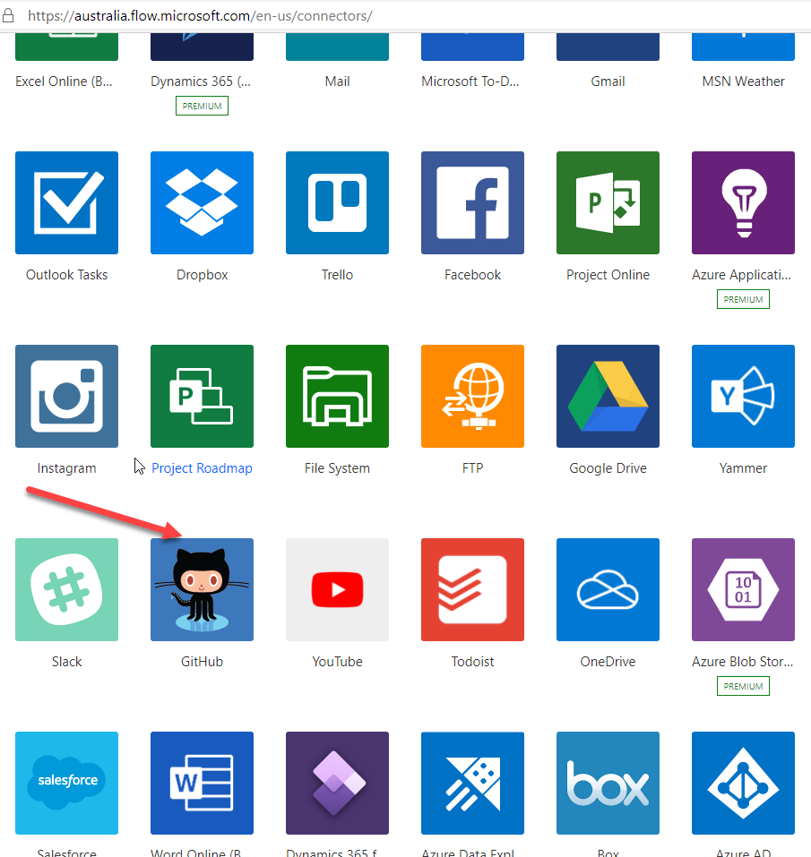
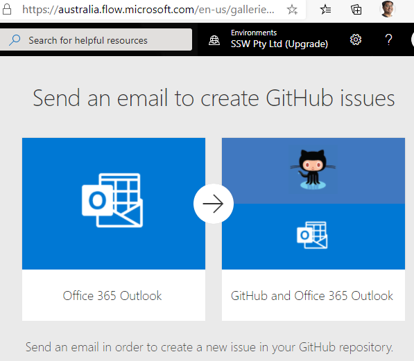
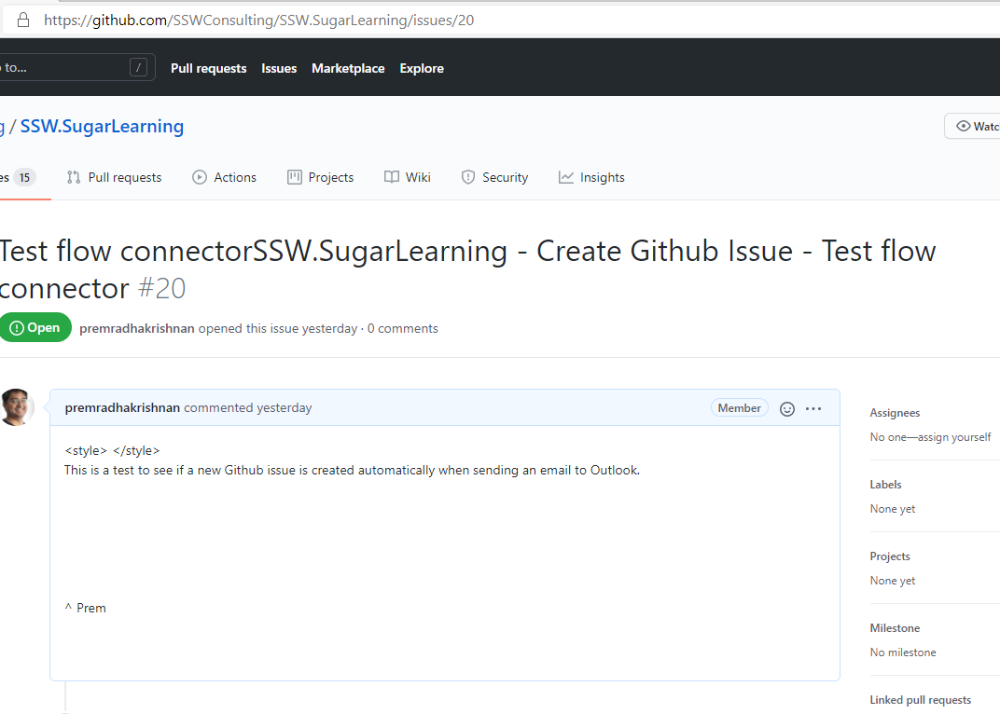
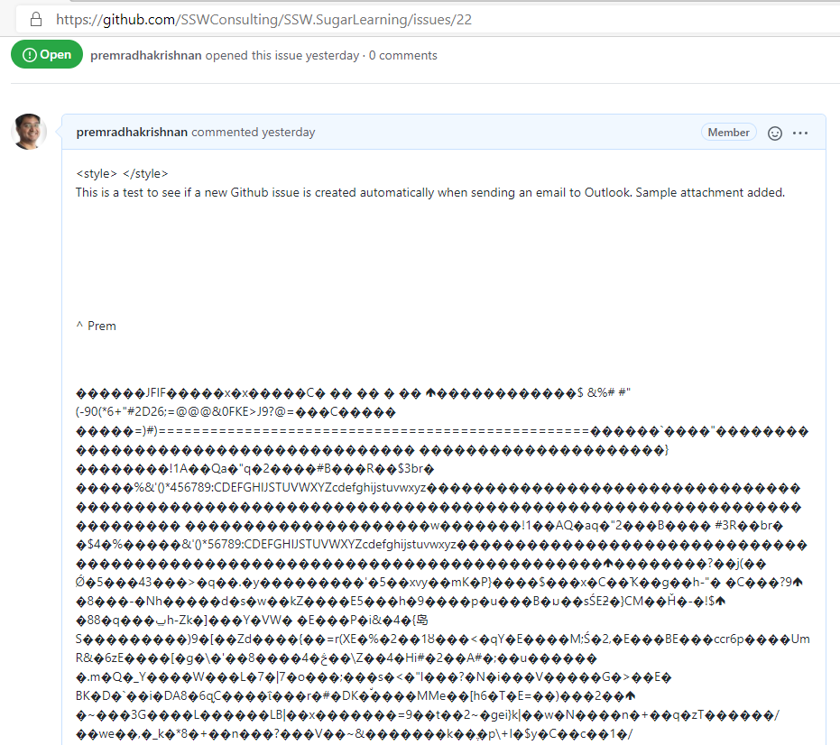

If a Product Owner sends an email to the development team with a request, that email should be turned into a Github Issue before any work is started or the work is prioritized on the backlog. 

Power Automate has a connector to do this automatically when an email arrives in Outlook. It can create a new Github Issue by parsing the From, To, Subject and body of the email. 

However, at the moment there is a limitation that it doesn't read inline attachments in emails and therefore you have to create your issues manually in Github.

<!--endintro-->

<dl class="image">&lt;dt&gt;
         
      &lt;/dt&gt;<dd>Figure: Power Automate | Connectors | Github </dd></dl><dl class="image">&lt;dt&gt;
         
      &lt;/dt&gt;<dd>Figure: Configure Flow connectors to create a new Github Issue from Outlook </dd></dl>
🔥Warning: This Flow connector does not suport inline images.

<dl class="goodImage">&lt;dt&gt;
         
      &lt;/dt&gt;  
      <dd>Figure: Good Example - Github issue created from Outlook using Flow connectors  </dd></dl>

 
<dl class="badImage">&lt;dt&gt;
         
      &lt;/dt&gt;  
      <dd>Figure: Bad Example - Github issue created using Flow - inline attachment shows up as junk characters </dd></dl>

### Related rules

* [Do you know the 3 steps to a PBI?](/_layouts/15/FIXUPREDIRECT.ASPX?WebId=3dfc0e07-e23a-4cbb-aac2-e778b71166a2&TermSetId=07da3ddf-0924-4cd2-a6d4-a4809ae20160&TermId=2c4dfc14-8084-4277-ae5e-7f5f692e4065)
* [Do you know when you use @ mentions in a PBI?](/_layouts/15/FIXUPREDIRECT.ASPX?WebId=3dfc0e07-e23a-4cbb-aac2-e778b71166a2&TermSetId=07da3ddf-0924-4cd2-a6d4-a4809ae20160&TermId=efd6c91e-7cc5-4473-a299-9104c8fd6e0d)
