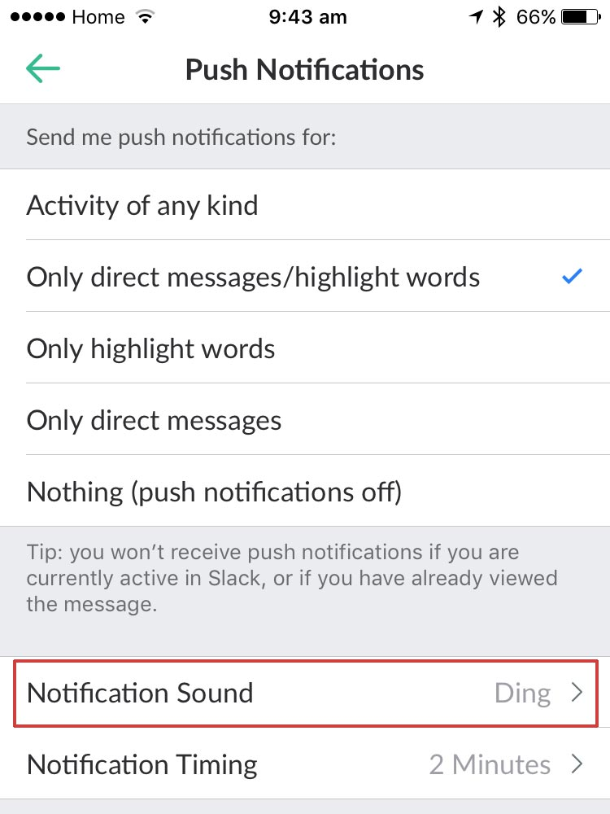
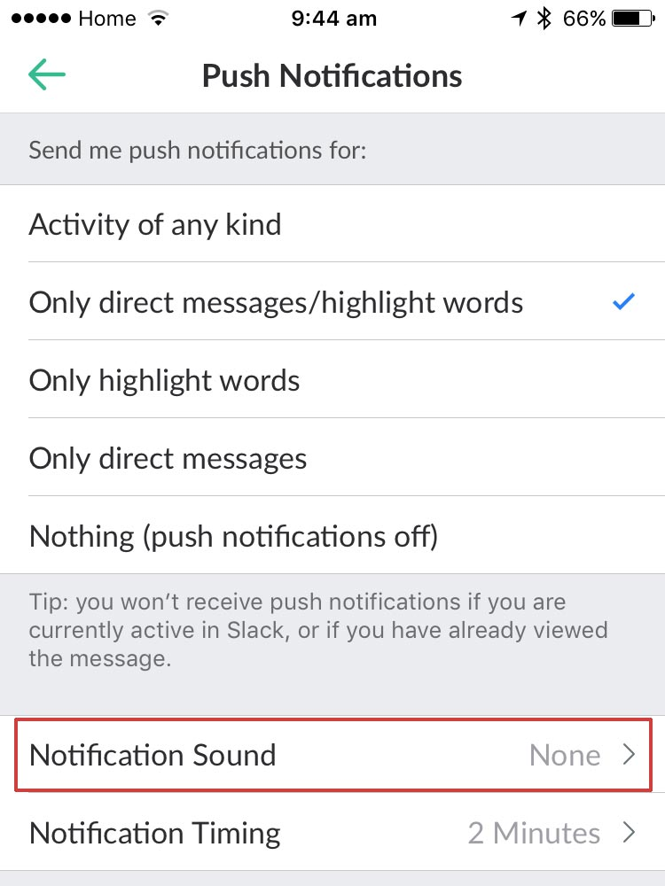

One of the main strengths of Slack is that, unlike SMS, Skype, and to some extent email, it is a pull based system, meaning that you only go to it in your own time to look at topics you’re interested in, rather than having the information pushed to you with attention grabbing notifications. For this reason, it’s important that you turn off the sounds on the iOS app, and potentially all notifications all together.

<!--endintro-->
<dl class="badImage">&lt;dt&gt;&lt;/dt&gt;<dd>Figure: Bad Example: The noises will grab your attention and interrupt your daily work</dd></dl><dl class="goodImage">&lt;dt&gt;&lt;/dt&gt;<dd>Figure: Good Example: although you’re still getting notifications, hopefully it’s only when you’re taking a break to look at your phone anyway</dd></dl>
