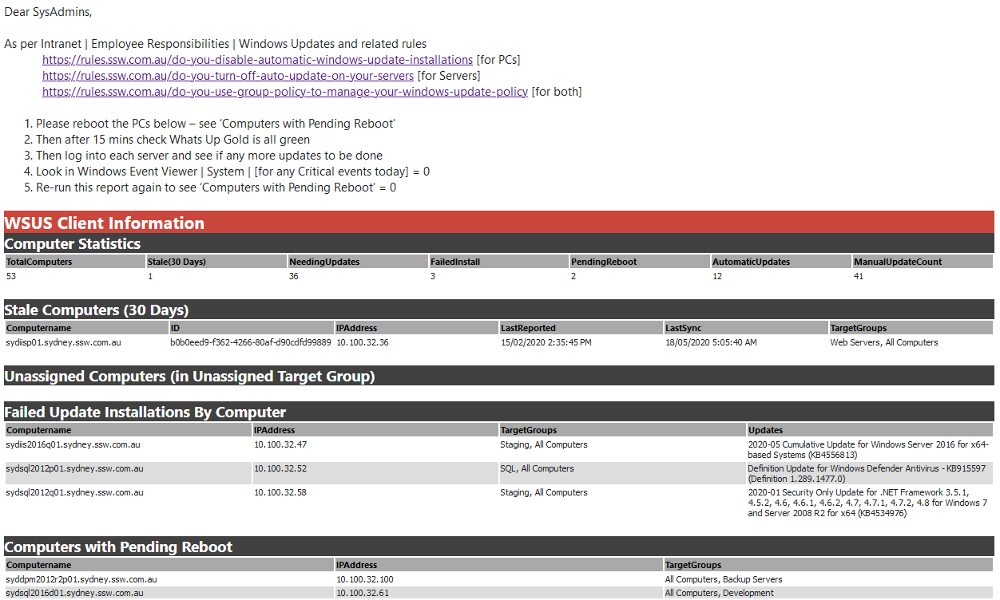

It is not a good idea to have Windows Update automatically updating your servers.  There are a few reasons.  

<!--endintro-->

1. The hotfix could bring down a production environment. (This issue previously happened)
2. In fact, even in a development environment, this could be hours of lost work as the development team struggles to understand why only         **some** of the developers' servers  **magically and mysteriously** broke overnight.
3. Windows Update could restart your server, or put your server in a state where it requires restarting - preventing any urgent MSI installs without bringing down the server.

Windows Update remains the best thing for end-users to protect their systems.  But in a server, especially a production server environment - Windows Update patches are just like any new versions of the software that's built internally.  It should be tested and then deployed in a controlled manner.

So recommendations for managing updates are as follows:

1. Use WSUS to approve/deny updates for your servers.
2. Update Staging/Development servers first to see if any issues arise from the updates.
3. Roll these updates out to Production once confident there are no issues.
4. Windows Updates may be critical and should be kept relatively up to date.
5. Do all of this on a schedule - have an email sent to your SysAdmins to remind them to review and reboot needed machines:

<dl class="goodImage">&lt;dt&gt;
   &lt;/dt&gt;<dd>Good Example: Scheduled email showing clear action points and WSUS stats </dd>
</dl>
###  Related Rules

* [Do you enable automatic Windows Update Installations?](/_layouts/15/FIXUPREDIRECT.ASPX?WebId=3dfc0e07-e23a-4cbb-aac2-e778b71166a2&TermSetId=07da3ddf-0924-4cd2-a6d4-a4809ae20160&TermId=f5432cb4-40af-491b-8da5-33b8a80dcb0a) [for PCs]
* [Do you use Group Policy to manage your Windows Update Policy?](/_layouts/15/FIXUPREDIRECT.ASPX?WebId=3dfc0e07-e23a-4cbb-aac2-e778b71166a2&TermSetId=07da3ddf-0924-4cd2-a6d4-a4809ae20160&TermId=eb2f95c5-22c8-4568-9173-9e52e3087faf) [for both PCs and Servers]
