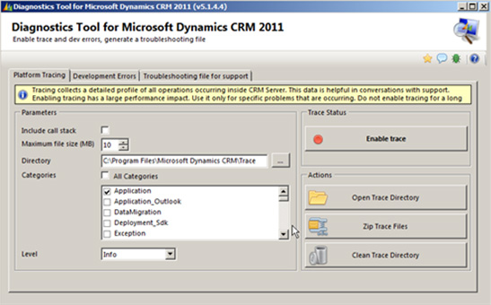

When exceptions occur in CRM they are trapped by the platform layer and a standard error message is displayed to the user. At SSW we similarly implement exception handling and use [SSW Code Auditor to audit exception handling](/_layouts/15/FIXUPREDIRECT.ASPX?WebId=3dfc0e07-e23a-4cbb-aac2-e778b71166a2&TermSetId=07da3ddf-0924-4cd2-a6d4-a4809ae20160&TermId=d700d2a5-872d-4fbd-acb7-1e2a2df1f07e).

<!--endintro-->

By turning DevErrors on (mainly applicable to CRM 3 and 4) you will obtain the actual error. This is what that will be posted onto newsgroups. Microsoft Support should also ask you for this information, so you probably cannot do any meaningful troubleshooting until this has been activated. To switch DevErrors on, open the web.config and change DevErrors value ="On".

::: ok  
  
:::

In CRM2011 we accomplish the same thing by turning on tracing. For more information on tracing refer to MS KB907490.

Now if all that info on the MS KS was too much, use the Diagnostics Tool for Microsoft Dynamics CRM 2011. It makes collecting trace information a snap.

::: ok  
  
:::
