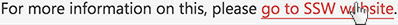

​Always make links perfectly clear.

 <excerpt class='endintro'></excerpt> 

It's very important that your links stand out from the background as well as the surrounding text. A solid underline and a contrasting color is the usually the best choice, but the exact method is not important as long as the end result stands out. A link should not only be discoverable upon accidental hovering.

Rollovers are important as they offer visual feedback to a user that this link that will take them somewhere. While there is a myriad of ways to do this; you can't go wrong with an underline or border-bottom.
<dl class="badImage">
For more information on this, please <a href="https://www.ssw.com.au/" style="border-bottom:none;color:inherit;">go to SSW website</a>. 
<dd>Bad Example: The link is hard to recognize </dd></dl><dl class="goodImage">
For more information on this, please <a href="https://www.ssw.com.au/">go to SSW website</a>.  
<dd>Good Example: This link is obvious  </dd>
​ 
        

<dd class="ssw15-rteElement-FigureGood"> Good Example: Obvious rollover. You can test it by hovering the links on ​the example above </dd></dl>
Example CSS for rollover:
<dl class="image"><dt>
a:hover {      color: #cc4141;     cursor: pointer; }  
</dt><dd>Figure: Example CSS for rollover effect  </dd></dl>

