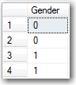
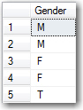

Scripting out a schema change is easy, worrying about data is not. "'Data motion" refers to a change in the meaning of data, which will require scripts which touch data and schema. 

 Let's look at an example:   
<!--endintro-->

We have a 'Gender' column (that is a Boolean) storing 0's and 1's. All works well for a while.
<dl class="image">&lt;dt&gt; 
      
   &lt;/dt&gt;<dd>Figure: Anything wrong this Gender column?  </dd></dl> Later you learn you need to change the data type to char(2) to support 'M', 'F', 'T', 'NA' and 'U'  <dl class="image">&lt;dt&gt; 
      
   &lt;/dt&gt;<dd>Figure: Caster Semenya has taught us a thing or two about the right data type for Gender </dd></dl> The data then must be migrated to the new data type this way:  
1. Rename 'Gender' to 'ztGender' \*
2. Add a new column 'Gender' with type char(2)
3. Insert the existing data from 'ztGender' to 'Gender' (map 0 to 'F' and 1 to 'M')
4. Delete the column ztGender\*

 \*Note: zt stands for Temporary  <dl class="image">&lt;dt&gt; 
      
   &lt;/dt&gt;<dd>Figure: Changing the data type and data required a <a href="/Pages/DoYouHaveAnUnderstandingOfSchemaChangesAndTheirIncreasingComplexity.aspx" shape="rect">"Data Motion Script"</a> </dd></dl>
Visual Studio does not automatically support this scenario, as data type changes are not part of the refactoring tools. However, if you add pre and post scripting events to handle the data type change the rest of the changes are automatically handled for you.
<dl class="image">&lt;dt&gt;
      
   &lt;/dt&gt;<dd>Figure: Don't use Data Dude</dd></dl>
note: In order to achieve this you MUST use the built in Refactor tools as it create a log of all the refactors in order. This helps Visual Studio generate the schema compare and make sure no data is lost.

There are few options available to perform data type change correctly:

        1. **Use manual scripts.** All data type changes including data migration can be performed by writing scripts manualy. This way you have full control over the change. It is recommended to use              [SQLDeploy](http://sqldeploy.com/) or              [DbUp](http://dbup.github.io/) to automate script deployment and keep track of all database changes.
        2. **Use Database Project.** As mentioned above, Visual Studio does not support data type changes out of the box and should not be used to perform this kind of task.
        3. **Use Entity Framework (EF) Code First Migrations.** If your application uses Entity Framework Code First, then it is strongly recommended to use Migrations feature.
Using EF Code First Migrations is comparable to using one of the below combinations:
- [DBUp](http://dbup.github.io/) +              [SQL verify](https://www.nuget.org/packages/SSW.SqlVerify.EF/)
-              [DAC Support For SQL Server Objects and Versions](https://technet.microsoft.com/en-us/library/ee210549%28v=sql.110%29.aspx)  (.dacpac files)
-              [SQL Deploy](http://sqldeploy.com/)

public partial class GenderToString : DbMigration
    {
        public override void Up()
        {
            AlterColumn("dbo.Customers", "Gender", c => c.String(maxLength: 2));
        }

        public override void Down()
        {
            AlterColumn("dbo.Customers", "Gender", c => c.Boolean(nullable: false));
        }
    }

::: bad
Bad Example - the default scaffolded migration will not perform any mapping of your data
:::

public partial class GenderToString : DbMigration
 {
 public override void Up()
 {
 AddColumn("dbo.Customers", "GenderTemp", c => c.Boolean(nullable: false));
 Sql("UPDATE [dbo].[Customers] set GenderTemp = Gender");
 DropColumn("dbo.Customers", "Gender");
 AddColumn("dbo.Customers", "Gender", c => c.String(maxLength: 2));
 Sql("UPDATE [dbo].[Customers] set Gender = 'M' where GenderTemp=1");
 Sql("UPDATE [dbo].[Customers] set Gender = 'F' where GenderTemp=0");
 DropColumn("dbo.Customers", "GenderTemp");
 }

::: good
Good Example - Data motion with EF Migrations

:::
