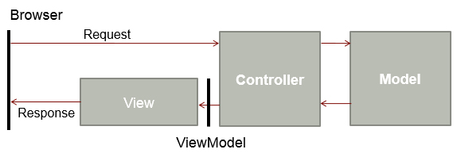
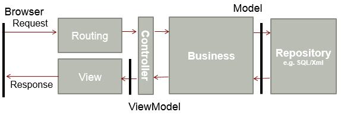

Figure: Bad Example – The sample applications  do not include the concept of a business Figure: Good Example – An enterprise solution should include a business layer and a data layer abstraction
<!--endintro-->
