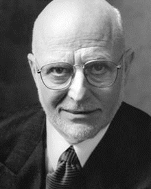

If you need to do something more than once, then there should be a standard for it. At the heart of our philosophy on creating rules and standards is the idea of consistency. There are 4 main benefits you will get:

<!--endintro-->

Say we are creating a windows forms application. We can expect to:

* **Improve productivity - because there are fewer decisions to make, and you build on existing work.**
  For example, we don't need to discuss the pros and cons of MDI versus SDI because there is [already a standard](https://www.ssw.com.au/ssw/Standards/Rules/RulesToBetterWindowsForms.aspx#AvoidMDI).
* **Improve quality - because you are following best practices.**
  For example, which logging library is better out of [Microsoft Application Block](https://www.ssw.com.au/ssw/Standards/Rules/RulesToBetterWindowsForms.aspx#ExceptionManagement) or [Log4NET](https://www.ssw.com.au/ssw/Standards/Rules/RulesToBetterWindowsForms.aspx#Log4Net).
* **Improve communications - because people know what to expect.**
  For example, when we complete a task we are clear and educate the customer by including a screenshot, the code and the time taken. We are consistent with whether we call it a bug or a feature because we [define what's a bug.](/management-is-your-client-clear-on-the-definition-of-a-bug)
* **Get straight to the meat of the customer's problem.**
  For example, our developers don't need to decide whether to implement base forms or user controls. They already know because it's covered in [Rules to Better Windows Forms Applications](https://www.ssw.com.au/ssw/Standards/Rules/RulesToBetterWindowsForms.aspx#UserControls).

At SSW we create standards for all manner of processes: from coding practices to project proposals and how to lock the office up at night. From the developer's perspective, consistency means that we understand each other's code, and if we don't know something, a standard will often save us asking someone. No more Chinese whispers and less time wasted. From the customer's perspective, consistency leads to a reliable and repeatable experience.

The following story illustrates these values:

::: greybox

**The Barber** (excerpt from "The E Myth")

I went to a barber who, in our first meeting, gave me one of the best haircuts I had ever had. He was a master with the scissors and used them exclusively, never resorting to electric shears as so many others do. Before cutting my hair, he insisted on washing it, explaining that the washing made cutting easier. During the haircut, one of his assistants kept my cup of coffee fresh. In all, the experience was delightful, so I made an appointment to return.

When I returned, however, everything had changed. Instead of using the scissors exclusively, he used the shears about 50 percent of the time. He not only didn't wash my hair but never even mentioned it. The assistant did bring me a cup of coffee, but only once, never to return. Nonetheless, the haircut was again excellent.

Several weeks later, I returned for a third appointment. This time, the barber did wash my hair, but after cutting it, preliminary to a final trim. This time he again used the scissors exclusively, but, unlike the first two times, no coffee was served, although he did ask if I would like a glass of wine. At first, I thought it might be the assistant's day off, but she soon appeared, busily working with the inventory near the front of the shop.

As I left, something in me decided not to go back. It certainly wasn't the haircut-he did an excellent job. It wasn't the barber. He was pleasant, affable, seemed to know his business. It was something more essential than that.

There was absolutely no consistency to the experience.

The expectations created at the first meeting were violated at each subsequent visit. I wasn't sure what to expect. And something in me wanted to be sure. I wanted an experience I could repeat by making the choice to return.

The unpredictability said nothing about the barber, other than that he was constantly - and arbitrarily - changing my experience for me. He was in control of my experience, not I. And he demonstrated little sensitivity to the impact of his behaviour on me. He was running the business for him, not for me. And by doing so, he was depriving me of the experience of making a decision to patronize his business for my own reasons, whatever they might have been.

It didn't matter what I wanted.

It didn't matter that I enjoyed the sound of scissors and somehow equated them with a professional haircut.

It didn't matter that I enjoyed being waited on by his assistant.

It didn't matter that I enjoyed the experience of having my hair washed before he set to work and that I actually believed it would improve the quality of the haircut.

I would have been embarrassed to ask for these things, let alone to give my reasons for wanting them. They were all so totally emotional, so illogical. How could I have explained them, or justified them, without appearing to be a boob?

What the barber did was to give me a delightful experience and then take it away.

What you do in your model is not nearly as important as doing what you do the same way, each and every time.

:::
**Figure: The Barber gave an inconsistent experience. Excerpt from "The E Myth"** 

Standards don't need to come at the expense of creativity. Following standards means less time doing the administrative stuff and more time for the creative. Of course, standards are works in progress, and so we are always on the lookout for improvements. That's why standards should be shared with everyone.
