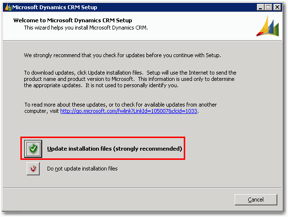

When running the Microsoft CRM 4 installation file, you can check for setup updates.

<!--endintro-->

* If the CRM server has an Internet connection, you can click  **Update installation files** during the upgrade. Updates then will be automatically downloaded and applied to your installation files.<dl class="image" style="padding-right:1.2em;padding-left:1.2em;font-size:1em;"><dt style="font-size:1em;line-height:17px;">&lt;/dt&gt;<dd style="line-height:17px;color:#000000;">Figure: Update CRM installation files</dd></dl>
* If the CRM Server does not have an Internet connection, you can download setup updates from the Microsoft website and manually deploy them. The instructions on how to manually deploy setup updates can be found in the [CRM Implementation Guide](http://www.ssw.com.au/SSW/Redirect/MSDNTaskList.htm).
