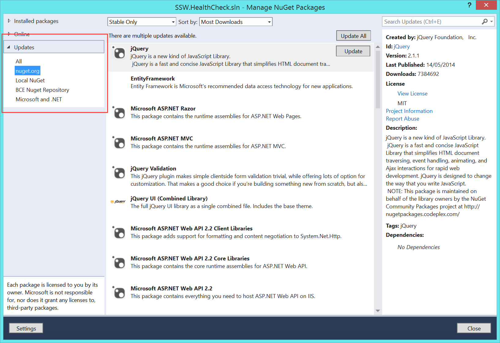
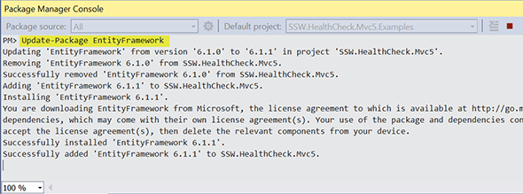

NuGet packages can quickly get out of date and you may miss some important updates and/or features. Therefore, it is important to keep them up-to-date by updating on a regular basis. This can be done via the Package Manager UI or via the Package Manager Console.

<!--endintro-->
<dl class="goodImage">&lt;dt&gt;&lt;/dt&gt;<dd>Figure: Good example -  NuGet packages via Package Manager are all up-to-date</dd></dl><dl class="image">&lt;dt&gt;&lt;/dt&gt;<dd>Figure: Update one package at a time eg. The command 'Update-Package EntityFramework' will update the one NuGet package via the Package Manager Console. Then test   </dd></dl>
**\*\*WARNING\*\***

Some package updates may require extra care, such as packages containing content files or updated client script libraries. For example, the jQuery NuGet package update may break the UI of your web application due to some breaking changes introduced in a later version of the library (e.g. upgrading from v 1.10 to 2.0).

The impact of such upgrades can be greatly minimized by introducing Selenium or Coded UI tests into your solution. Running Selenium or Coded UI tests after performing a NuGet package update, can help to quickly identify problematic areas in your UI, which may be affected by the update.
