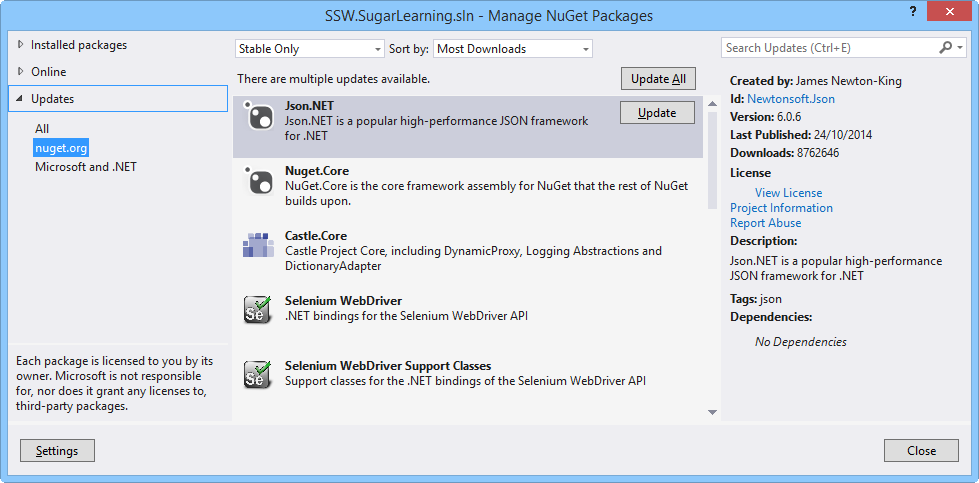

NuGet makes it easy to find and apply package updates – but this still must be performed manually.

<!--endintro-->

Each package update should contain improvements but also involves a small amount of risk in the form of breaking changes or regressions.

Updating often can help mitigate this risk by ensuring that each individual update is smaller.

Recommended practice is to apply package updates at the start of a Sprint so that there is time to find and resolve issues introduced by the update.

Visual Studio will give you a count of how many outdated packages are present in your solution.

