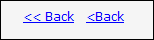

According to http://msdn.microsoft.com/en-us/library/ms997609.aspx, the commands for navigating through a wizard should be "< Back" and "Next >".   
<!--endintro-->

When your site needs a link to iterate backwards through records we recommend that you use "< Back" instead of "< Previous".

There are a few reasons for this:

1. This is the standard used in Microsoft Installation files. MSIs are the most widely used installation package available today.
2. Internet Explorer and several other lesser known browsers use a Back button to iterate back through webpages, so your visitors will automatically know what your "< Back" link does.
3. It is important to keep a consistency on your pages.

Below is an example of a Good "< Back" link versus some Bad variations.
<dl class="goodImage">    &lt;dt&gt; &lt;/dt&gt;
    <dd>Figure: A Good example of a "< Back" link </dd></dl><dl class="badImage">    &lt;dt&gt; &lt;/dt&gt;
    <dd>Figure: This is Bad because it says "Previous" instead of "Back" </dd></dl><dl class="goodImage">    &lt;dt&gt; &lt;/dt&gt;
    <dd>Figure: This is bad because it has too many "<"s or it has no space between the "<" and the "Back" </dd></dl>
We have a program called [SSW Code Auditor](http://www.ssw.com.au/ssw/CodeAuditor) to check for this rule.

We have a program called [SSW Link Auditor](http://www.ssw.com.au/ssw/LinkAuditor) to check for this rule. We offer a [rule sample page](http://www.ssw.com.au/SSW/LinkAuditor/Samples/Rules/ReadingBackLink.aspx) for demo scan.
