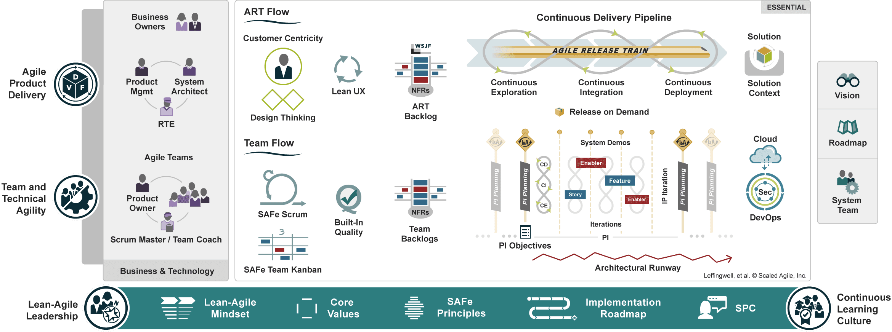
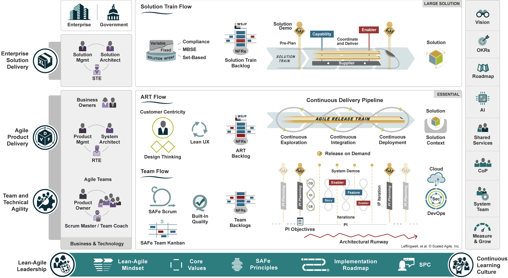

While many of us appreciate the benefits of Scrum in project management, the challenge amplifies when coordinating multiple Scrum teams towards a singular vision. In such scenarios, maintaining alignment and ensuring consistent value delivery at scale can become overwhelming. This is precisely where the Scaled Agile Framework (SAFe) steps in.

<!--endintro-->

## What is SAFe?

SAFe, or the Scaled Agile Framework, is a comprehensive agile software development framework crafted by [Scaled Agile, Inc.](https://scaledagile.com/) While traditional agile methodologies like Scrum are tailored for individual teams, SAFe is designed specifically for larger enterprises. 

It provides a structured approach to scaling agile and lean practices across multiple teams or departments. By doing so, SAFe ensures alignment, collaboration, and delivery across vast organizational landscapes, driving teams towards unified strategic objectives.

### Benefits of Using SAFe

**Alignment** 

SAFe ensures that multiple agile teams are seamlessly aligned, collaboratively working towards shared organizational objectives. 

By fostering a clear understanding of strategic goals and value streams across teams, SAFe eliminates silos and promotes a unified approach to problem-solving and product delivery. This centralized vision not only streamlines processes but also ensures that all teams are consistently moving in the right direction, maximizing the overall value delivered to the end-users and stakeholders.

**Coordination**

SAFe adeptly streamlines roles and responsibilities, facilitating enhanced coordination among diverse teams. 

By establishing clear interfaces and touchpoints, SAFe ensures that teams can collaboratively address dependencies, manage risks, and seamlessly integrate their efforts. This coordinated approach not only reduces potential bottlenecks and conflicts but also fosters an environment where teams can synergize their strengths and work harmoniously towards collective outcomes.

**Quality**

SAFe places a significant emphasis on continuous delivery, ensuring that quality remains at the forefront of all endeavors. 

By integrating practices such as built-in quality checks, regular feedback loops, and iterative improvements, SAFe ensures that products and solutions not only meet but often exceed expectations. This commitment to quality extends beyond the codebase; it encompasses the overall user experience, functionality, and performance. As a result, organizations leveraging SAFe can be confident in delivering solutions that are robust, reliable, and resonate with the needs of the end-users.

::: greybox
Use SAFe to align your Scrum teams and work towards common objectives.
:::

::: good

:::

## Why Should You Use SAFe?

### Better Scalability

Scrum is undoubtedly effective for single teams, delivering agility and adaptability in those settings. However, when the organizational landscape involves multiple teams or even entire departments, the complexities grow exponentially. SAFe addresses this challenge head-on by offering a robust framework that allows for scalability. 

It provides the structure and guidelines necessary to scale up agile practices across the organization without sacrificing the core principles of agility. This means organizations can handle larger initiatives, coordinate across diverse teams, and ensure that they're all aligned, efficient, and responsive, all while maintaining the agile spirit.

::: greybox
Implement SAFe practices to scale your agile teams.
:::

::: good

:::

### Improved Governance

SAFe introduces a refined approach to governance, skillfully balancing the need for structure with the agility that's paramount in modern development. By providing clear roles, responsibilities, and decision-making protocols, SAFe ensures that compliance and quality standards are consistently upheld. 

But what truly sets it apart is its ability to achieve this without suffocating the agile spirit. Through its iterative processes and feedback mechanisms, SAFe empowers teams to adapt and innovate, all while operating within a defined governance framework. This results in a system where governance becomes an enabler, rather than a barrier, to rapid and effective product development.

::: greybox
Adopt SAFe for a balanced approach to governance and agility.
:::

::: bad

:::

## Conclusion

In today's complex development landscape, managing multiple Scrum teams can pose significant alignment and coordination challenges. Adopting SAFe stands as a powerful remedy to these issues. More than just aligning teams, SAFe provides a comprehensive framework tailored for scaling agile practices effectively, ensuring consistent quality, and facilitating improved governance. 

As you navigate the intricacies of large-scale projects, integrating the SAFe methodology can indeed be a transformative decision for your organization.

<!--endintro-->
