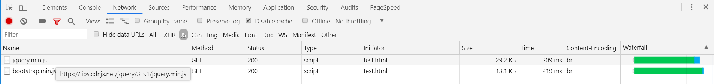

​If your site takes too long to load, there is a high chance your users will not wait for it to finish loading and abandon viewing it. It is therefore important that we use techniques to make pages load as quickly as possible. One of these techniques is to use a Content Delivery Network (CDN) to reduce the network latency for delivering pages, images, javascript and CSS libraries to users​. This results in faster page load times and a ​better experience for your users. 

 <excerpt class='endintro'></excerpt> 
<strong style="color:#333333;">What is a CDN?</strong> CDN is short for a Content Delivery Network. It is a system of distributed servers (network) that deliver pages and other Web content to a user, based on the geographic locations of the user, the origin of the webpage and the content delivery server.
 <strong style="color:#333333;">Why use a CDN?</strong>

<strong style="color:#333333;"></strong>A website may be hosted in a particular region, but have the majority of its users coming from an entirely different region – for example, if your site is hosted in North America, GTmetrix(A free tool that analyzes your page's speed performance) might report fast speeds based on our default test location, but if a good chunk of your users come from China, their speed will not be as fast as you experience it to be. Using a CDN can improve your user’s experience in terms of speed, and as we know – speed matters!​ Ensuring a consistent experience for all your users is important. CDNs not only ensure a faster experience to your users, but they also help to prevent site crashes in the event of traffic surges – CDNs help to distribute bandwidth across multiple servers, instead of allowing one server to handle all traffic.​ 

 

<strong>How to choose a CDN?</strong> 

When choosing a CDN provider, take into account where your user base is located and which CDN provider support those locations. For example, some CDN provides are not fast or reliable when accessed from China (behind the Great Firewall). 

 <strong style="color:#333333;">Which CDNs work well from China?</strong>

<strong style="color:#333333;"></strong>1.http://www.staticfile.org/ 2.http://www.bootcdn.cn/ 3.http://cdn.code.baidu.com/ 4.http://lib.sinaapp.com/ 5.http://cdnjs.net/ 

6.https://www.cloudflare.com/network/china/(Cloudflare’s China Service​) 

7.https://www.akamai.com(Akami) 

8.https://cdnjs.cloudflare.com ​ 

 <strong style="color:#333333;">Which ones do not work well from China?</strong> 1.https://maxcdn.bootstrapcdn.com 2.https://ajax.googleapis.com​ ​​  

<dd class="ssw15-rteElement-FigureBad">Figure: Bad example, jquery.min.js from GoogleAPIs failed to load. </dd> 

<dd class="ssw15-rteElement-FigureGood">F​igure: Good example, jquery.min.js from CDNJS isn't block and is very fast.​​ </dd>​​ 
​

