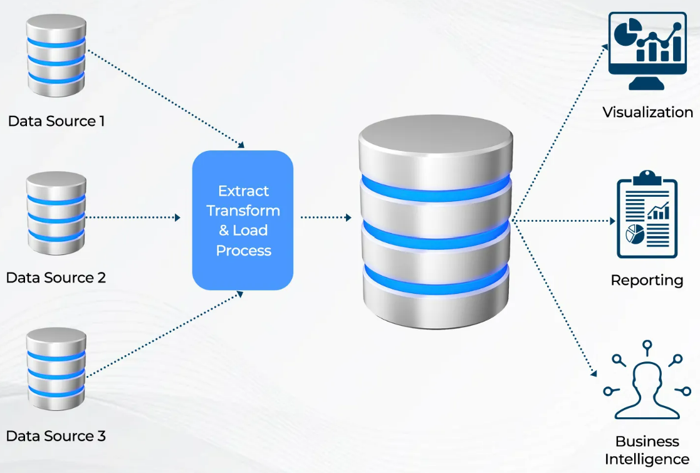

A Data Warehouse is a centralized repository of data that is used for analysis and reporting, providing organizations with valuable insights to support decision-making processes. While a Data Warehouse offers significant benefits, it is essential to consider its appropriate use cases and limitations.

<!--endintro-->

A Data Warehouse is a powerful tool used in the software development industry to store, integrate, and manage vast amounts of data collected from multiple sources within an organization. It acts as a central repository that consolidates data from transactional systems, operational databases, external sources, and more. This consolidated data is then transformed and optimized for efficient reporting, analytics, and business intelligence purposes.

`youtube: https://www.youtube.com/watch?v=AIGRlKiiF50`
**Video: Intoduction to Data Warehouses**

## When to use a Data Warehouse
* **Complex Analytical Reporting:** Data Warehouses excel at handling complex queries and generating comprehensive reports across different dimensions of the data. If your organization requires in-depth analysis, trend identification, and complex reporting on large volumes of historical and real-time data, a Data Warehouse can be a valuable asset.

* **Decision Support:** When making strategic decisions based on data-driven insights, a Data Warehouse provides a reliable foundation. It enables the integration of data from multiple sources, which allows for a comprehensive view of the organization's operations, customers, and market trends. With a Data Warehouse, you can derive meaningful business intelligence and support decision-making processes effectively.

* **Data Integration:** If your organization deals with disparate data sources such as databases, spreadsheets, files, or external systems, a Data Warehouse offers a unified platform for integrating and harmonizing the data. It enables data cleansing, transformation, and consolidation, ensuring consistency and accuracy across various data sets.

* **Historical Analysis:** Data Warehouses retain historical data over extended periods, enabling retrospective analysis and trend identification. This capability is particularly useful for businesses that require insights into long-term performance, customer behavior, market trends, and forecasting.

## When *not* to use a Data Warehouse
* **Real-time Transactional Processing:** Data Warehouses are not suitable for real-time transactional processing where immediate response and low-latency data access are critical. Operational databases or other specialized systems are more suitable for such use cases.

* **Small-scale Data Storage:** If your organization deals with relatively small volumes of data that don't require extensive integration, analysis, or long-term historical retention, a Data Warehouse may introduce unnecessary complexity and overhead. In such cases, simpler data storage and retrieval solutions might suffice.

* **Temporary Data Analysis:** If you only need to perform ad hoc analysis on short-lived datasets, it may be more efficient to use other data analysis tools or platforms that don't involve building and maintaining a Data Warehouse.

Remember, the decision to use a Data Warehouse should be based on the specific needs and requirements of your organization. Consider factors such as data volume, complexity, analytical needs, and long-term data retention before opting for a Data Warehouse solution.

