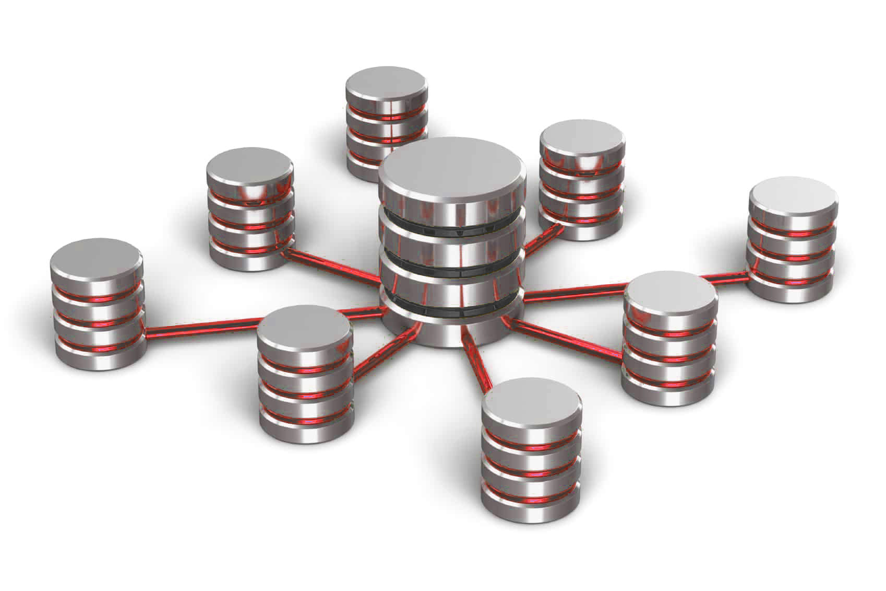

A Data Warehouse is a centralized repository of data that is used for analysis and reporting, providing organizations with valuable insights to support decision-making processes. A Data Warehouse can offer significant benefits, so understanding its appropriate use cases and limitations is essential.

<!--endintro-->

::: img-medium

:::

Data Warehouses act as a central repository that consolidate vast amounts of data from transactional systems, operational databases, external sources, and more. This consolidated data is then transformed and optimized for efficient reporting, analytics, and business intelligence purposes.

`youtube: https://www.youtube.com/watch?v=AIGRlKiiF50`
**Video: Introduction to Data Warehouses (3 min)**

Basic (video above) - \[YouTube: Cody Baldwin] gives a good overview of data warehouses, and why you'd want to build one.

Advanced - \[YouTube: Azure Synapse Analytics] If you want to see an example, take a look at the video [The Ultimate Data Warehouse experience in Microsoft Fabric (8 min)](https://www.youtube.com/watch?v=GnCI22Tp-cM) which shows how you can create a data warehouse in Microsoft Fabric.

### ✅ When to use a Data Warehouse

* **Complex Analytical Reporting:** Data Warehouses excel at handling complex queries and generating comprehensive reports across different dimensions of the data. If your organization requires in-depth analysis, trend identification, and complex reporting on large volumes of historical and real-time data, a Data Warehouse can be a valuable asset.
* **Decision Support:** When making strategic decisions based on data-driven insights, a Data Warehouse provides a reliable foundation. It enables the integration of data from multiple sources, which allows for a comprehensive view of the organization's operations, customers, and market trends. With a Data Warehouse, you can derive meaningful business intelligence and support decision-making processes effectively.
* **Data Integration:** If your organization deals with disparate data sources such as databases, spreadsheets, files, or external systems, a Data Warehouse offers a unified platform for integrating and harmonizing the data. It enables data cleansing, transformation, and consolidation, ensuring consistency and accuracy across various data sets.
* **Historical Analysis:** Data Warehouses retain historical data over extended periods, enabling retrospective analysis and trend identification. This capability is particularly useful for businesses that require insights into long-term performance, customer behavior, market trends, and forecasting.

### ❌ When **not** to use a Data Warehouse

* **Real-time Transactional Processing:** Data Warehouses are not suitable for real-time transactional processing where immediate response and low-latency data access are critical, as the data will often need to be cleaned or transformed (typically as a part of the ETL stage) before it can be used. Operational databases or other specialized systems are more suitable for such use cases.
* **Small-scale Data Storage:** If your organization deals with relatively small volumes of data that don't require extensive integration, analysis, or long-term historical retention, a Data Warehouse may introduce unnecessary complexity and overhead. In such cases, simpler data storage and retrieval solutions might suffice.
* **Temporary Data Analysis:** If you only need to perform ad hoc analysis on short-lived datasets, it may be more efficient to use other data analysis tools or platforms that don't involve building and maintaining a Data Warehouse.

::: greybox

### Example

The business **Northwind Chips & Cream** sells hot chips and ice cream from their fleet of food trucks, operating across Australia.

The company wants to analyze its sales data across geographic locations and weather factors. They want to optimize their food truck distribution according to the highest grossing suburbs in each city for each day's conditions.

* The company's sales data is stored in an Accounting system (ACME).
* The trucks' locations are stored in a Fleet Management Library (FML).
* The weather data comes from the country's weather API (BOM).

A Data Warehouse is a compelling recommendation, because:

* Analytical goals are clearly defined
* Time variant data is used
* Daily forecasts incentivize automation
* Disparate data sources require aggregation
* No real-time data ingestion required

:::

## How to create a Data Warehouse

Creating your own data warehouse involves several key steps. Here's a general overview of the process:

### 1. Define Business Goals and Objectives

The first step is to clearly define the business goals and objectives that the Data Warehouse will support. This involves understanding the specific analytical and reporting requirements of the organization. Identify the key areas where data insights can drive value, such as improving operational efficiency, enhancing customer experience, or enabling strategic decision-making. By aligning the Data Warehouse project with the business goals, you ensure that it addresses the specific needs of the organization.

### 2. Conduct Data Assessment

Conducting a thorough data assessment is crucial to understand the current state of data within the organization. This step involves identifying the sources of data, data quality issues, data formats, data volume, and data integration requirements. Assessing the existing data infrastructure helps identify any gaps or inconsistencies that need to be addressed before implementing a Data Warehouse. It also helps in understanding the scope and complexity of data integration efforts required for successful implementation.

### 3. Develop a Data Warehouse Strategy and Architecture

After defining business goals and assessing data, the next step is to develop a comprehensive Data Warehouse strategy and architecture. This involves determining the appropriate architecture for the Data Warehouse, including decisions related to data modeling, data extraction, transformation, loading processes, and data storage. Consider factors such as scalability, performance, security, and future growth requirements. Additionally, establish a governance framework for data management, including data ownership, access controls, and data privacy considerations. Developing a clear strategy and architecture provides a roadmap for the implementation of the Data Warehouse and ensures its alignment with the organization's long-term goals.

### Popular Data Warehouse products

* [Microsoft Fabric](https://www.microsoft.com/en-au/microsoft-fabric)
* [Azure Synapse Analytics](https://azure.microsoft.com/en-au/products/synapse-analytics/)
* [Amazon Redshift](https://aws.amazon.com/redshift/)
* [Google BigQuery](https://cloud.google.com/bigquery)
* [Snowflake](https://www.snowflake.com/)
* (On prem) [Microsoft SQL Server](https://www.microsoft.com/en-au/sql-server/sql-server-downloads)
* (On prem) [SQL Server Analysis Services](https://learn.microsoft.com/en-us/analysis-services/ssas-overview?view=asallproducts-allversions)

Remember, the decision to use a Data Warehouse should be based on the specific needs and requirements of your organization. Consider factors such as data volume, complexity, analytical needs, and long-term data retention before opting for a Data Warehouse solution.
