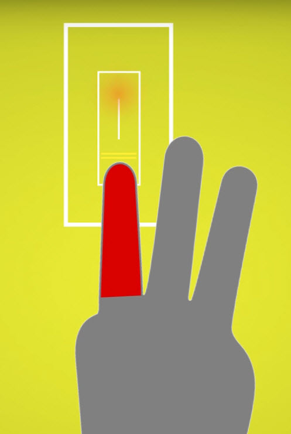
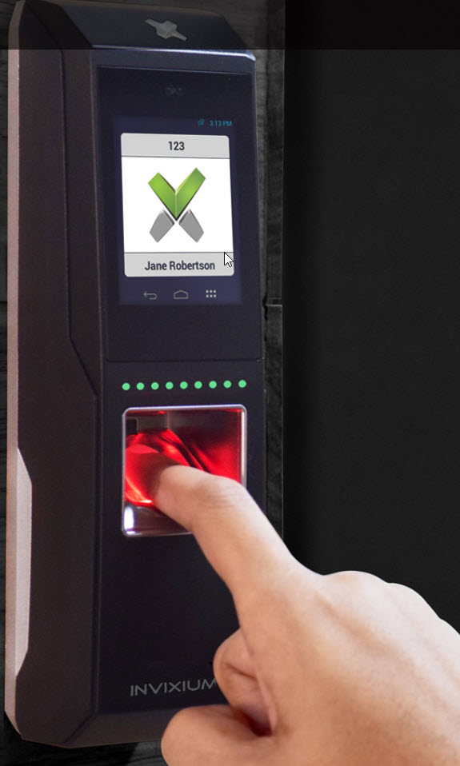

Do you know who is entering your premises, when and how? Keys or key-cards can be expensive, they can be lost and people can loan them to one another without any restriction.

<!--endintro-->

Finger scanners are a good way of monitoring and restricting access to secure areas. As every person’s fingerprint is unique, so is the access to your building.  There is no physical mechanism for unlocking the doors, which means you do not have to worry about lost keys or unauthorized access and it can keep a log of entry.

SSW uses an Invixium fingerprint scanner. The user interface is easy to use, you simply hold your finger down on the screen and it will either allow or deny you access. Other fingerprint scanners like E-Key use a swipe function that is less intuitive for visitors.

The Invixium integrates well with our Control4 Automation system.

::: bad

:::

::: good

:::

See [Better Software Suggestions for Control4](https://bettersoftwaresuggestions.com/category/control4/).
