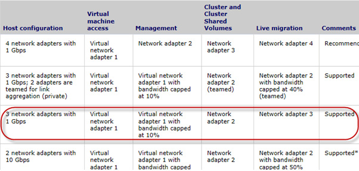

Microsoft lists several recommended and supported network configurations. It is very important that you configure your Hyper-V Cluster with one of the supported network types otherwise you will have performance issues once you load up the cluster.

<!--endintro-->

[>Microsoft Hyper-V Live Migration – Network Configuration](http://technet.microsoft.com/en-us/library/ff428137%28WS.10%29.aspx) page (this example has 3 networks)** 
It may work fine initially on a non-supported configuration but when you start loading more Virtual Machines on to the cluster the performance will be degrade dramatically.
