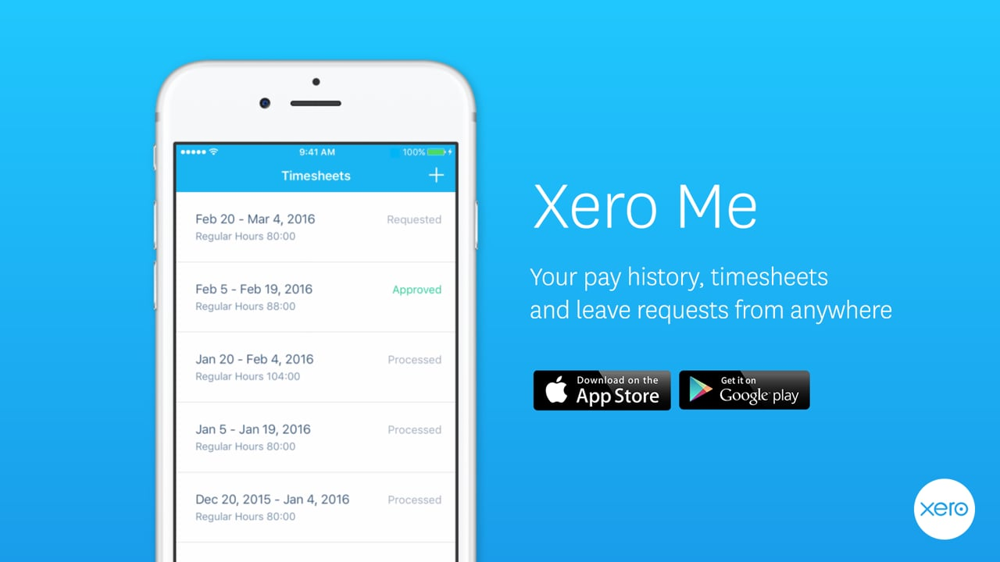

Xero is a great Accounting Software for all small businesses and especially for managing payroll. 

Xero Payroll allows for the employee to access their payroll details on web. These details include payslips, leave entitlements, requesting leave, personal information and bank accounts. It is a useful tool and many employees would benefit for long term planning with this kind of access, as well as saving countless hours of admin and back and forth emails for the payroll officer.

<!--endintro-->

Xero has released a mobile app version of Xero Payroll called "Xero Me" which has a majority of the same function as the web version. Similarly, employees would be able to access their usual information as per the web version except for salary and bank account. 

As such, the app makes for a great handy tool for employees to check their information, submit timesheets and request leave on the go. 

.png)

Simply click the plus symbol to add a new leave request and put in the basic information (type of leave, approver, days or hours taken and description). The approver will then get a notification and can easily approve or reject the request.

.png)

.png)

The app is free and as versatile as the web version with an added function of convenience. We highly recommend the use of a Xero mobile app to manage your personal payroll.
