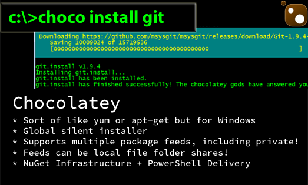

A package manager is a collection of software tools that automate the process of installing, upgrading, configuring, and uninstalling computer programs in a consistent manner.

<!--endintro-->

## Option 1: Chocolatey (Recommended)

Chocolatey is a great package manager, easy to use way to manage software on Windows. 



To get started with Chocolatey open up Command Prompt in Administrative mode, type in:

```bash
@powershell -NoProfile -ExecutionPolicy Bypass -Command "iex ((new-object net.webclient).DownloadString('https://chocolatey.org/install.ps1'))" && SET PATH=%PATH%;%ALLUSERSPROFILE%\chocolatey\bin
```

Alternatively, [install Chocolatey via their website](https://chocolatey.org/install).

## Option 2: Winget

[Winget](https://learn.microsoft.com/en-us/windows/package-manager/) is Microsoft's own package manager that developers can use to discover, install, upgrade, remove and configure a curated set of applications.

Winget can be installed from the [Microsoft Store.](https://www.microsoft.com/p/app-installer/9nblggh4nns1#activetab=pivot:overviewtab)

Once installed you can search for a tool with:

```bash
winget search <appname>
```

And then install the tool with:

```bash
winget install <appname>
```

For example:


For more information see [MS Learn](https://learn.microsoft.com/en-us/windows/package-manager/winget/).

## Option 3: Homebrew

Homebrew is the preferred option when on a Mac
