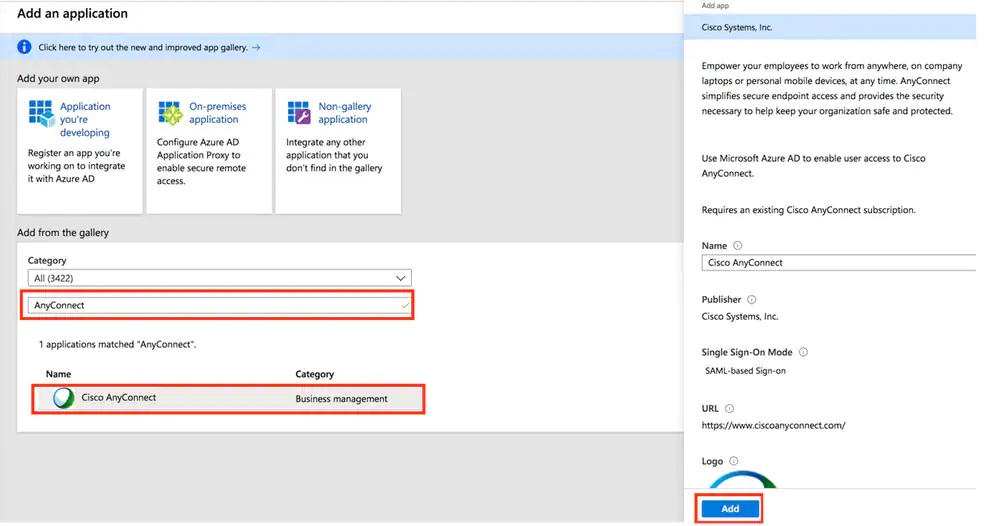

If you have a Remote Access VPN, it is important to ensure that the VPN is secure. VPNs are a common point of attack in cyber security incidents - if a bad actor can get into your VPN, they're in your network.

<!--endintro-->

These days, the most important way to secure your VPN is to use MFA. The best way to set this up will depend on the VPN and current MFA solution you are using. For example, Fortigate have their own MFA solution, using a "FortiToken".

If you're using Cisco AnyConnect and Azure AD, it is easy to set up authentication through SAML - so your Azure MFA will be applied to any VPN logins. See Cisco's documentation [here](https://www.cisco.com/c/en/us/support/docs/security/anyconnect-secure-mobility-client/215935-configure-asa-anyconnect-vpn-with-micros.html).

It is also important to make sure that your VPN uses a secure protocol. Previously PPTP was a popular method, but this is now a deprecated service as it can be hacked very quickly using online tools.

It is recommended to go with a provider that uses SSL or IPSec protocols.