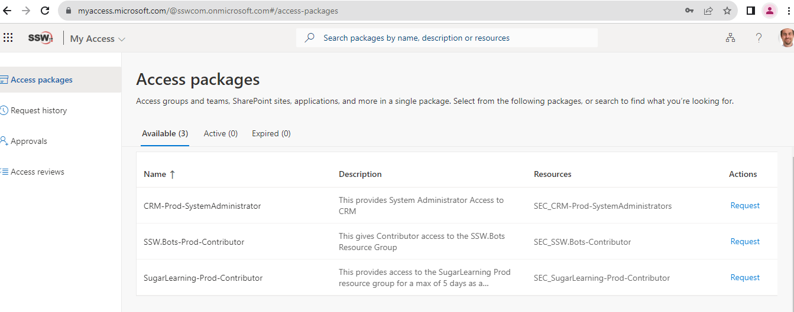
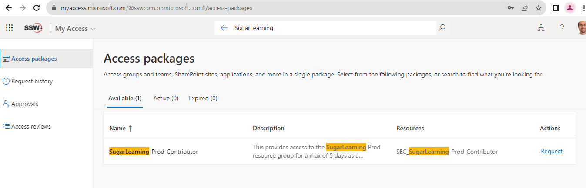
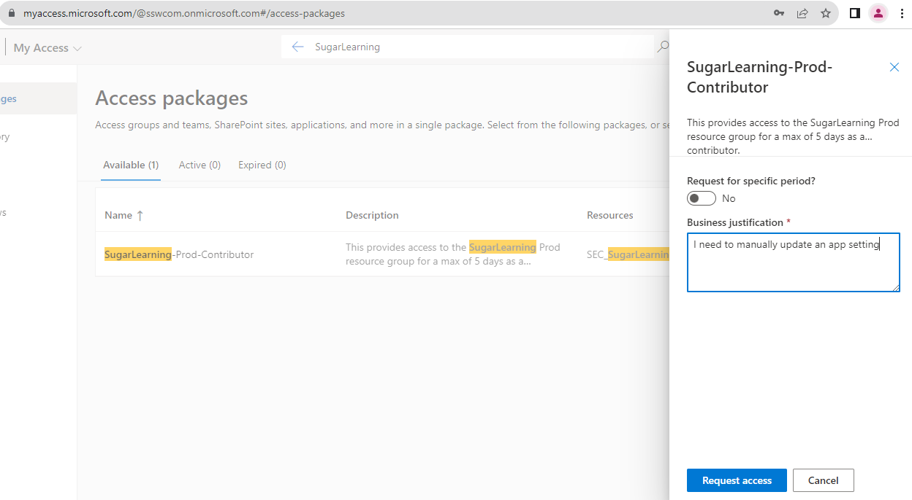
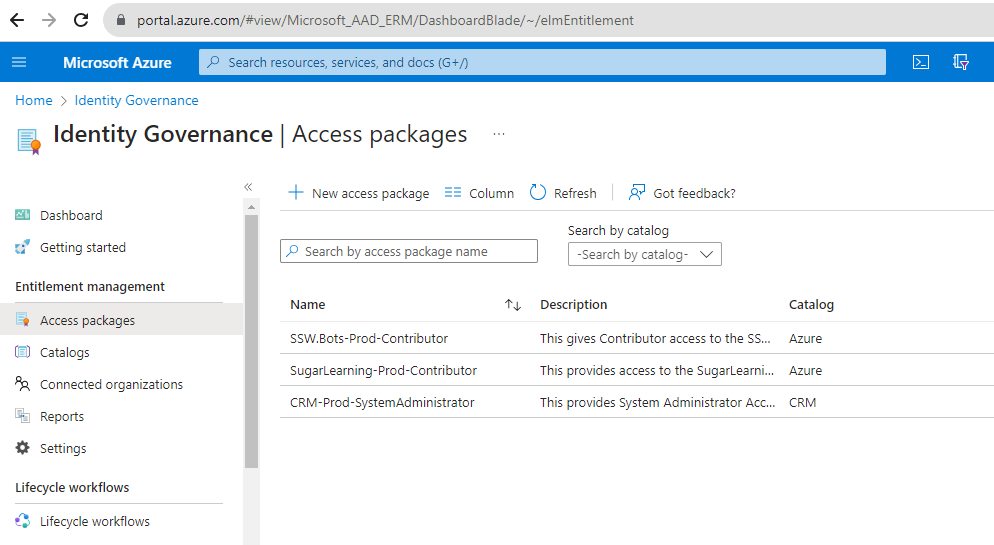
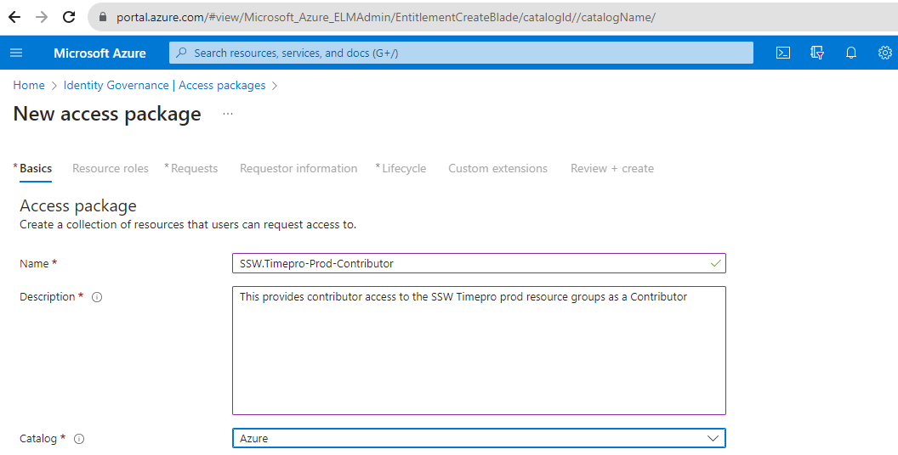
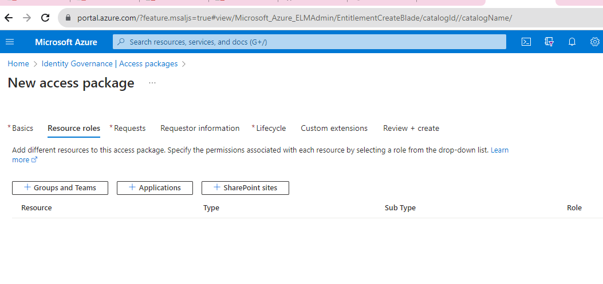
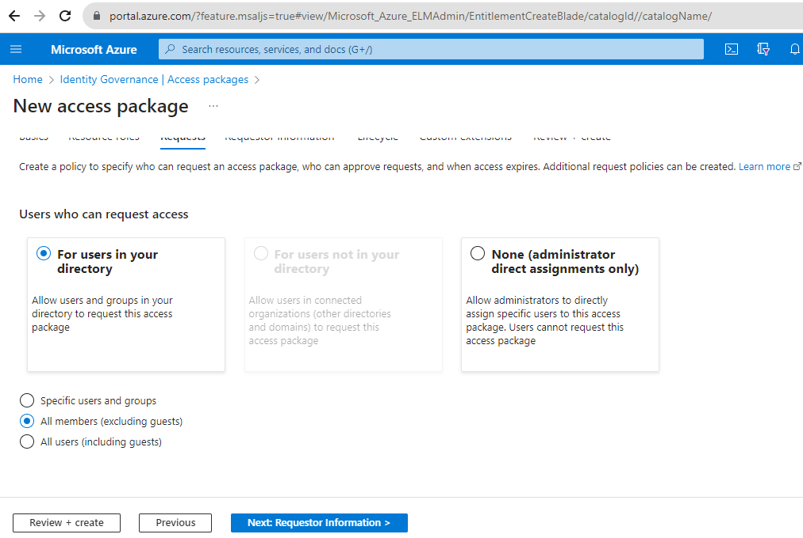
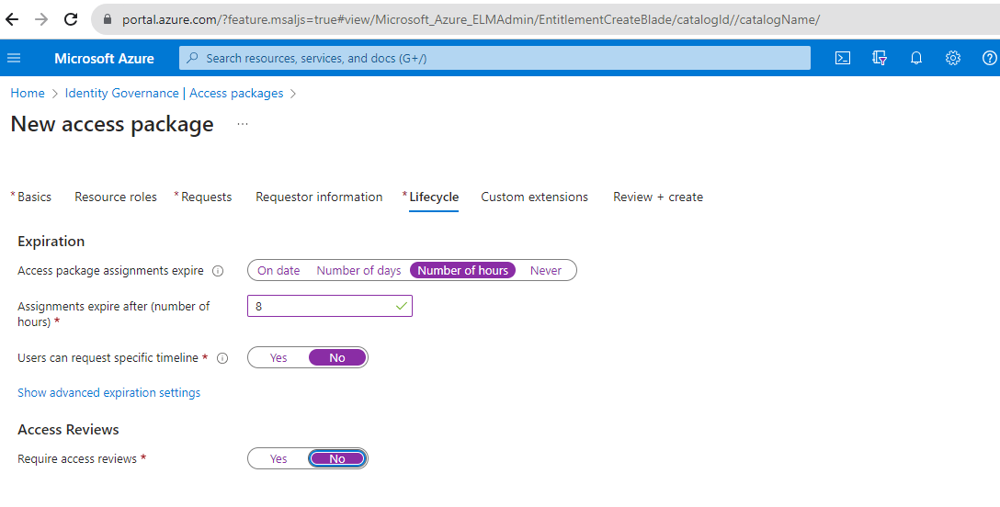
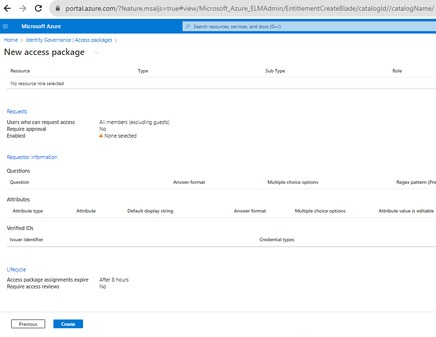

In today's complex digital landscape, managing user access to resources can be a daunting task for organizations. Entra Access Packages emerge as a game-changer in this scenario, offering a streamlined and efficient approach to identity and access management.

By bundling related resources into cohesive packages, they simplify the process of granting, reviewing, and revoking access. This not only reduces administrative overhead but also enhances security by ensuring that users have the right permissions at the right time. Furthermore, with built-in automation features like approval workflows and periodic access reviews, organizations can maintain a robust and compliant access governance structure. Adopting Azure Access Packages is a strategic move for businesses aiming to strike a balance between operational efficiency and stringent security.

<!--endintro-->

## ❌ Bad Example - Manually Requesting Access via Email

In the old-fashioned way, users would send an email to the SysAdmins requesting access to a specific resource. This method is prone to errors, lacks an audit trail, and can lead to security vulnerabilities.

::: email-template

|          |     |
| -------- | --- |
| To:      | SysAdmins|
| Cc:      | |
| Subject: | Request for Access to SugarLearning Prod |
::: email-content  

### Dear SysAdmins

I would like to request access to SugarLearning Prod as Contributor. Please grant me the necessary permissions.

Thanks

Warwick
:::
:::

::: bad
Figure: Bad example - This requires manual changes by a SysAdmin
:::

## ✅ Good Example - Requesting Access via myaccess.microsoft.com

Instead of manually sending emails, users can request access through `myaccess.microsoft.com`, which provides a streamlined, auditable, and secure method.

1. **Navigate** to `myaccess.microsoft.com`

   :::good
   
   :::
2. **Search** for the desired resource or access package.

   
3. **Request Access** by selecting the appropriate access package and filling out any necessary details.

   
4. Wait for **approval** from the people responsible for the resource

   :::greybox
   **If you require immediate access ping them on Teams**
   :::

- - -

## Steps to Create an Access Package

1. **Open Azure Portal**: Navigate to Azure Active Directory | Identity Governance | Access packages.

   
2. **New Access Package**: Click on `+ New access package`.
3. **Fill Details**: Provide a name, description, and select the catalog for the access package.

   
4. **Define Resources**: Add the resources (applications, groups, SharePoint sites) that users will get access to when they request this package.

   
5. **Set Policies**: Define who can request the package, approval workflows, duration of access, and other settings.

   

   
6. **Review and Create**: Ensure all details are correct and then create the access package.

   
