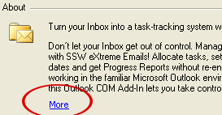
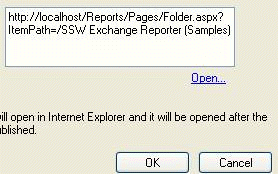
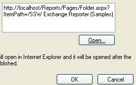
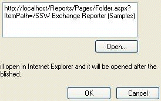
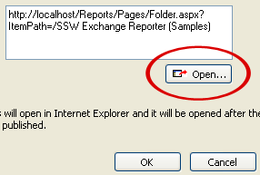

Opening a specific web page (that the user is aware of) from a windows application should always be in the form of a hyperlink. Below is a simple example of a hyperlink simply opening a web page containing just more information or help.

<!--endintro-->

However if you are taking action then opening the page (e.g concatenating the URL, etc) then you must have an image button to illustrate the action which will be taken.

Here is a compilation of a few bad examples for this:

::: bad

:::

::: bad

:::

::: bad

:::

But when it requires some form of action (e.g. generating reports, passing and processing values), use a button with an image.

::: good

:::

**Note:** Screenshot contains XP button because the .Net 1.1 button does not support images, however the default button in .NET 2.0 supports images. E.g. `EdwardForgacs.Components.WindowsUI.dll`
