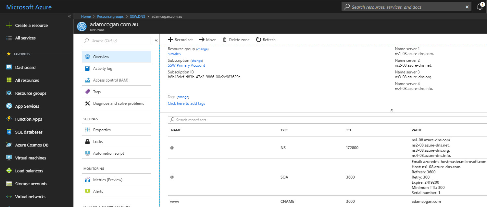

 What is ANAME record? ANAME record (also known as A record) is an alias record that allows you to map the apex record or any other record within your domain to a target host name, essentially a CNAME record for the apex record. ANAME record is especially useful for when you have multiple domain names and your website is hosted by a provider that changes it's IP Address, this does happen quite regularly with WPEngine. Many DNS service provider does not support ANAME record, however, <a href="http://dnsmadeeasy.com/">DNSMadeEasy</a> has made this service available.

 <excerpt class='endintro'></excerpt> 

Configuring ANAME is as easy as configuring CNAME. Let's have a look at DNS records for adamcogan.com.au, DNS records contains apex record for adamcogan.com.au and a <b>www.adamcogan.com.au</b>. The apex record uses ANAME, while CNAME for <b>www.adamcogan.</b><b>au</b> - now we will never have to worry about updating these records, they will follow the DNS records of <b>adamcogan.com</b>. ​
<dl class="image"><dd>Figure: Example DNS entry from Azure DNS ​​​​ ​ </dd></dl>

