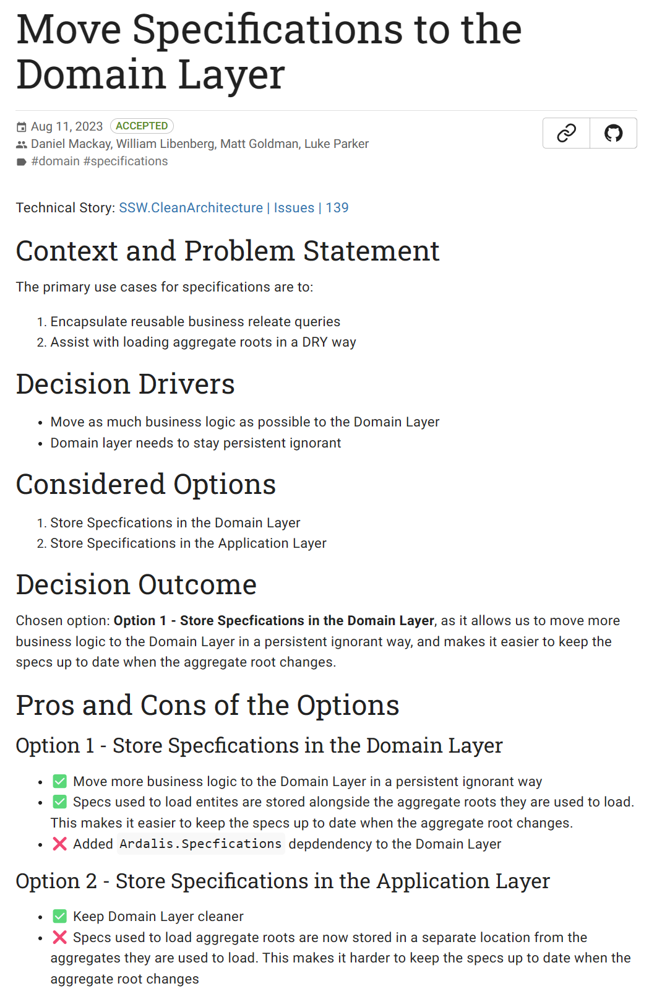

Architectural Decision Records (ADRs) are lightweight documents use to record important decisions in your project. They do not necessarily have to be related to architecture, but could be any important decision made by the team.

<!--endintro-->

## What are the dangers of not documenting important decisions?

1. Lack of transparency and communication
2. Loss of intellectual property
3. Loss of historical context
4. Risk of repeating mistakes
5. Difficulty in auditing and governance

## What are the advantages of using ADRs?

1. Providing documentation and historical context
2. Collaboration and communication
3. Informed Decision making
4. Decision re-evaluation
5. Avoiding blind acceptance or reversal

The act of documenting an important decision, forces developers to think more objectively about their decision.  If the decision is likely to cause contention it may be quicker to document it via an ADR and get feedback, than it would be to implement the change and let the reviewer try to infer your reasoning.

Additionally, documenting decision 'deciders' ensures that we have a 2nd pair of eyes across the decision, just like we do with the [checked by rule](/checked-by-xxx), [test please rule](/do-you-conduct-a-test-please-internally-and-then-with-the-client), and [pull-requests](/over-the-shoulder).

ADRs can also help with knowledge sharing across teams, as other Solution Architects will have access to a succinct explanation of the problem and the decided solution.

Another benefit is that future developers joining the project now have access to the historical context as to why certain decisions were made.

## Where should ADRs be stored?

They should be stored wherever the technical documentation for your project lives.  Storing them in Git along with your code works well, but alternatively wherever your technical documentation lives (i.e. a wiki).

## What Can I use to Create and Manage ADRs?

There are several tools available to help create and managed ADRs, but one of the best ones is [Log4Brains](https://github.com/thomvaill/log4brains).  Log4Brains can help to create and view ADRs.

This can be installed by running:

```bash
npm install -g log4brains
```

You can then initialize your git repo by running:

```bash
log4brains init
```

Which will guide you through a simple setup process.

To create a new ADR, run:

```bash
log4brains adr new
```

Lastly, to preview your ADRs, run:

```bash
log4brains preview
```

## ADR Examples



You can see more examples of ADRs with log4brains in action on our [SSW.CleanArchitecture template](https://sswconsulting.github.io/SSW.CleanArchitecture/).

## Related Articles

* [Dan Does Code - Demystifying Architectural Decision Records Why Every Project Needs Them](https://www.dandoescode.com/blog/demystifying-architectural-decision-records-why-every-project-needs-them)
