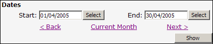

According to [Design Specifications and Guidelines - User Assistance](https://docs.microsoft.com/en-us/previous-versions/ms997609%28v=msdn.10%29?WT.mc_id=DT-MVP-33518), the commands for navigating through a wizard should be "&lt; Back" and "Next &gt;".

<!--endintro-->

When your site needs a link to iterate backward through records we recommend that you use "&lt; Back" instead of "&lt; Previous".

There are a few reasons for this:

1. This is the standard used in Microsoft Installation files. MSIs are the most widely used installation package available today.
2. Internet Explorer and several other lesser-known browsers use a Back button to iterate back through webpages, so your visitors will automatically know what your "&lt; Back" link does.
3. It is important to keep consistency on your pages.

Below is an example of a Good "&lt; Back" link versus some Bad variations.

::: bad  
  
:::

::: bad  
  
:::

::: good  
  
:::
