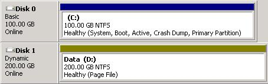
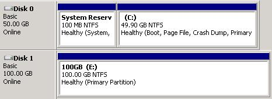

When formatting a new virtual disk you have attached to a Hyper-V Virtual Machine, you can choose to to format the disk as a <strong>Basic disk </strong>or <strong>Dynamic</strong> <strong>disk</strong>. 
 
A <strong>Dynamic</strong> <strong>disk </strong>might be useful in situations where you want to create a software RAID array, but when using Hyper-V this not a good idea because it prevents Microsoft Data Protection Manager (DPM) from doing Child State Backups (backups while the machine is running). 
 
For this reason, never use <strong>Dynamic disks </strong>inside Hyper-V Virtual Machines. 
 
 
Figure: Bad Example - DPM cannot backup this Virtual Machine's child state as it has a Dynamic Disk 
 
 
Good example – Using Basic Volumes allows DPM to backup the Virtual Machine’s child state 

 <excerpt class='endintro'></excerpt> 

