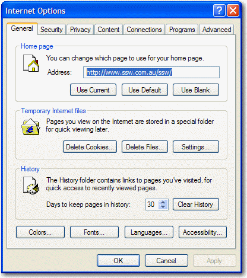
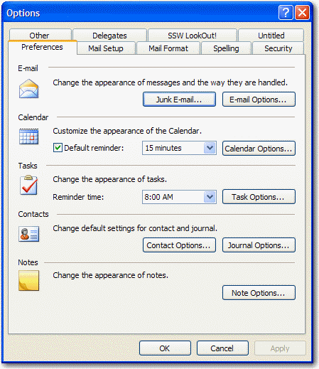
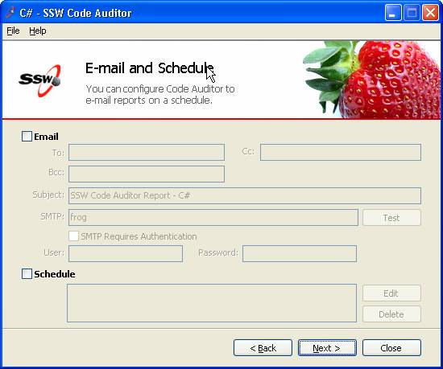

Many applications have a lot of content on each form. If this is the case there                     needs to be some way to separate certain sections. To achieve this separation Microsoft                     (and therefore most developers) uses separating lines, but this UI is not perfect                     because:

* It creates additional visual clutter
* It is hard to maintain

<!--endintro-->

We recommend using bold instead of dividing lines because:

1. Bold stands out
2. Indentation is more important
3. Developers are not good at keeping the lines aligned - you could create a .NET custom control to do this - but Microsoft do not provide one
    * The dividing lines create additional visual clutter (ever so slight)
    * Each line creates additional performance implications (ever so slight)

<dl class="badImage">&lt;dt&gt; 
      
   &lt;/dt&gt;<dd> Figure: Bad Example - This is the Tools - Options from Internet Explorer and it groups each section in a groupbox - busy UI. </dd></dl><dl class="badImage">&lt;dt&gt; 
      
   &lt;/dt&gt;<dd> Figure: Bad Example - This is the Tools - Options from Outlook and it uses dividing lines for each section.</dd></dl><dl class="badImage">&lt;dt&gt; 
      
   &lt;/dt&gt;<dd> Figure: Bad Example - This is an old screen from Code Auditor - the dividing lines are not required. </dd></dl><dl class="goodImage">&lt;dt&gt; 
      
   &lt;/dt&gt;<dd> Figure: Good Example - This is the new screen from Code Auditor - the bold title and indenting are the best way to show the sections.</dd></dl>
