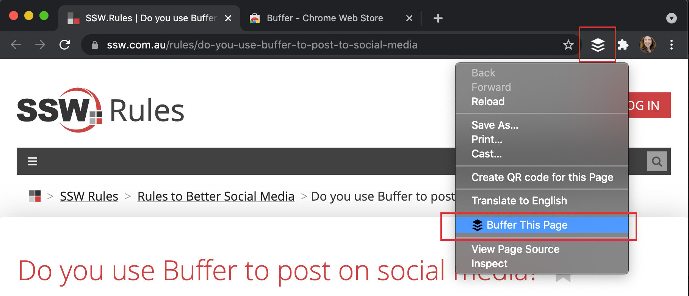
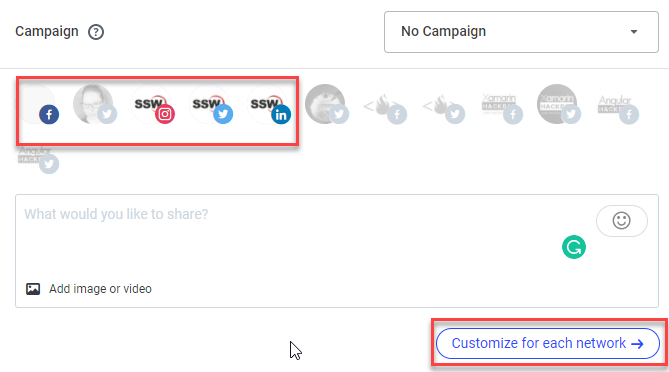
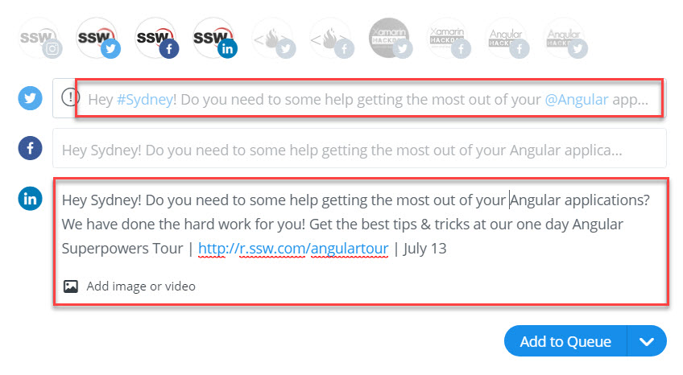
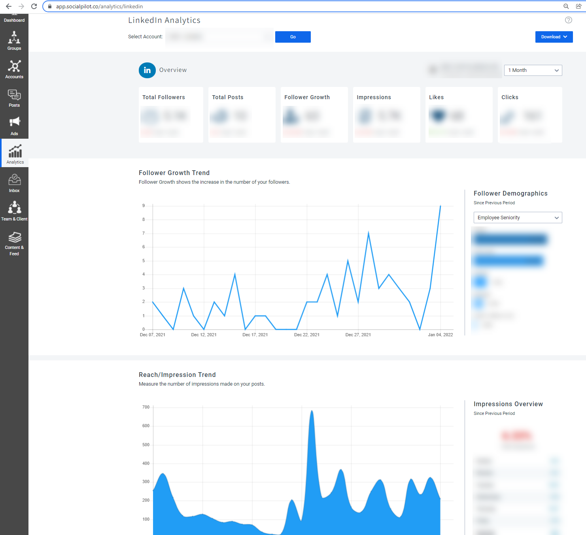

Social media management tools are a must-have marketing tool these days. They are software, web applications and apps that help a company to successfully manage content and engagement across different social networks. These tools offer many helpful features, like content scheduling, social analytics, teams collaboration, content creation, and many more.

We will go through a few options you can choose - each has different plans/prices and features that suit different businesses needs.

<!--endintro-->

## Buffer

Buffer is a great tool for managing multiple social media accounts across a range of sites such as Facebook, Instagram, LinkedIn, and Twitter. 

It allows you to choose which accounts to post to, can post to multiple social media accounts at once, and even lets you write and schedule your posts to be released over the course of a day or even over the next few weeks, so you don't need to be at your computer while maintaining an online presence. It also offers URL shortening and provides analytics so you can track the success of your posts across multiple sites.

You can either visit the [Buffer website](https://buffer.com/) or install the Buffer extension for your browser that sits next to the address bar of your browser.

The content of your posts should be consistent across accounts. When making a post that exceeds the character limit of a site such as Twitter, you should write a separate, shorter version of the post to send to that site only. You can also use the "Customize for each network" button on Buffer to modify the content to better suit the platform for each post. This means that you could write the content for a Tweet and then modify it to remove things like #Hashtags to post it to LinkedIn where they don't make sense.

::: bad
 
:::

::: good

:::

### \#Hashtags

Hashtags are used across social sites such as Twitter, Instagram and LinkedIn to identify a keyword or topic of interest and facilitate a search for similar posts on the topic.

Establish a short \#hashtag that can be easily associated with your brand, company, or campaign and ensure this #hashtag is used consistently across social networks, along with any other keywords relevant to the content of your post.

For more on SSW \#Hashtags, check out [Do you know how to use hashtags?](/do-you-know-to-use-hash-tags)

### Custom URL shortening

Buffer uses bit.ly for shortening URLs. You can create custom URLs at no cost by joining bit.ly and going into Settings | Advanced. This will allow even your shortened URL to carry your unique brand without the look of a long, untidy URL.

For more on bit.ly and URL shortening, check out [Rules to Better bit.ly](/rules-to-better-bit-ly).

**Tip:** Buffer does not tag people on Facebook. You will need to manually go onto the Facebook page you posted through and edit the post to tag the people you wanted.

## SocialPilot

A SaaS product, [SocialPilot](https://www.socialpilot.co/) is another really cost-effective option with many features, even under their most basic plan. They offer functionalities like a social media calendar, a social inbox, social media analytics, client and team management.

They allow you to connect to social media platforms such as TikTok, Instagram, Facebook, LinkedIn, Twitter and Google My Business. SocialPilot also integrates with platforms like Zapier, Canva, Snip.ly and Bit.ly.

## HootSuite

Available since 2008, [Hootsuite](https://www.hootsuite.com/) is a really complete tool for managing your socials. Besides the basics, Hootsuite also helps keep an eye on the latest social conversations, trends, and brand mentions. Hootsuite offers integration with Zendesk, Canva, Slack, Monday, and others, if you need app integration to manage your social media. Hootsuite also offers training through Hootsuite Academy’s industry-recognized certifications, depending on the plan your company chooses.

However, all of that comes at a price, and Hootsuite is one of the most expensive options.

## Sprout Social

Out in the market since 2010, [Sprout Social](https://sproutsocial.com/) is an all-in-one social media management platform, with product tools from Publishing and Scheduling to Employee Advocacy. Sprout Social allows you to connect to many networks Facebook, Twitter, Instagram, LinkedIn, YouTube, Pinterest, Tripadvisor and even Glassdoor.

Besides three options of plans, they have three additional and optional premium solutions: Listening (below), Premium Analytics and Employee Advocacy.

