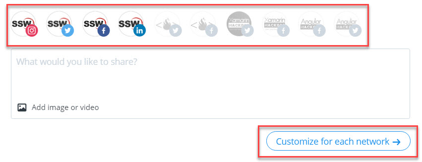
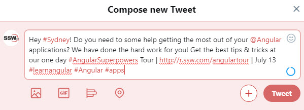

Buffer is a great tool for managing multiple social media accounts across a range of sites such as Facebook, Instagram, LinkedIn, and Twitter. 

It allows you to choose which accounts to post to, can post to multiple social media accounts at once, and even lets you write and schedule your posts to be released over the course of a day or even over the next few weeks, so you don't need to be at your computer while maintaining an online presence. It also offers URL shortening and provides analytics so you can track the success of your posts across multiple sites.

<!--endintro-->

You can either visit the [Buffer website](https://buffer.com/) or install the Buffer extension for your browser that sits next to the address bar of your browser.

  

 

The content of your posts should be consistent across accounts. When making a post that exceeds the character limit of a site such as Twitter, you should write a separate, shorter version of the post to send to that site only. You can also use the "Customize for each network" button on Buffer to modify the content to better suit the platform for each post. This means that you could write the content for a Tweet and then modify it to remove things like #Hashtags to post it to LinkedIn where they don't make sense.

::: bad
 
:::

::: good

:::

### #Hashtags

'Hashtags are used across social sites such as Twitter, Instagram and Facebook to identify a keyword or topic of interest and facilitate a search for similar posts on the topic.

Establish a short #Hashtag that can be easily associated with your brand, company, or campaign and ensure this #Hashtag is used consistently across social networks, along with any other keywords relevant to the content of your post.

**Note:** LinkedIn does not support #Hashtags. If you use them in a post, they will show up on LinkedIn pages as plain text.

For more on SSW #Hashtags, check out [Do you know how to use Hashtags?](/do-you-know-to-use-hash-tags)

### Custom URL shortening

Buffer uses bit.ly to shorten URLs. You can create custom URLs at no cost by joining bit.ly and going into Settings | Advanced. This will allow even your shortened URL to carry your unique brand without the look of a long, untidy URL.

For more on bit.ly and URL shortening, check out [Rules to Better bit.ly](/rules-to-better-bit-ly)

**Tip:** Buffer does not tag people on Facebook. You will need to manually go onto the Facebook page you posted through and edit the post to tag the people you wanted.
