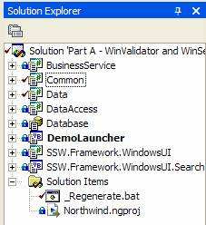

Code generators can be used to generate whole Windows and Web interfaces, as well as data access layers and frameworks for business layers, making them an excellent time saver. I dont care which one you use as long as you invest the time and find one you are happy with. The one important thing is they must have command line support and the files they generate should be recognizable as code generated by prefix or a comment like Dont touch as this was automatically generated code. Make it easy to run by putting all the command line operations in a file called '_Regenerate.bat'.

<!--endintro-->

Therefore I say a _Regenerate.bat file must exist under the solution items to recreate data access layer and stored procs.

The built in Data Form Wizard in Visual Studio .NET is not any good. I prefer other code generators like:

* [CodeSmith](https://ssw.com.au/ssw/Redirect/CodeSmith.htm) - Good for generating strongly-typed collections\
  Note: it also includes templates for Rocky Lhotka's CSLA architecture from a SQL Server database.
