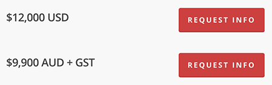

In numbers of more than 3 digits, always use commas. This makes reading much easier.
<!--endintro-->

::: bad  
  
:::

::: good  
  
:::

Numbers which normally do not take commas are:

* ZIP codes
* Phone numbers
* Serial numbers
* House numbers
* Dates of years

**Note:** Different countries use a periods in place of comma and vice-versa.
E.g. In United States and Australia: **2,367.48 francs**  / In France: **2.367,48 francs** .
